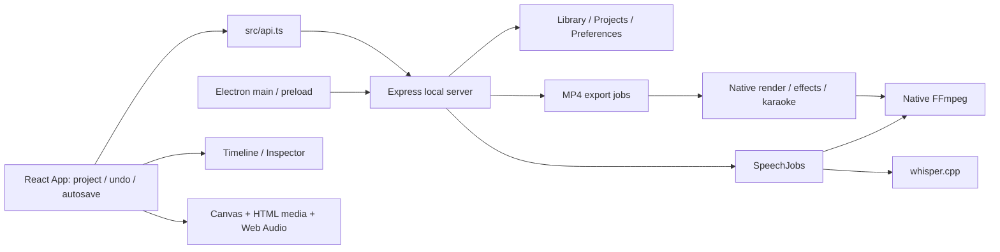
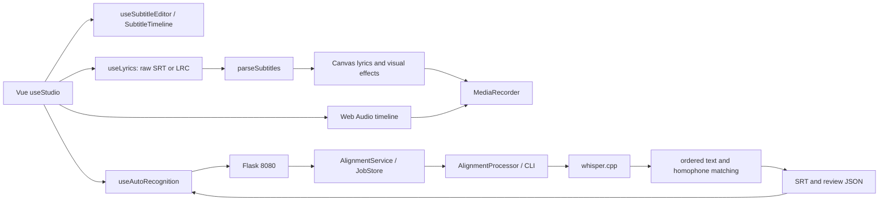

# 現有架構盤點：MyCut 與 LyricFlow

盤點日期：2026-09-29。MyCut 基準 commit：`0414dc6`；LyricFlow：`60b2ef9`。兩邊開始盤點時 Git 工作區皆無修改。

2026-09-30 更新：這份文件是兩個專案整合前的歷史架構盤點。MyCut 原稿對齊現已使用安裝包內的本機引擎；執行時不呼叫 LyricFlow、不共用 Python 服務，也不安裝 LyricFlow 的 npm package。現況以 `LYRICS_ENGINE_INTEGRATION.md` 為準。

本文件記錄當時現況；原始整合設計見 [LYRICS_ENGINE_PLAN.md](LYRICS_ENGINE_PLAN.md)。2026-09-29 盤點交付只完成 Step 1、Step 2，當時尚未實作歌曲精準對齊。

## 1. 專案範圍與確認結果

| 項目 | MyCut | 音樂視覺化工具 |
| --- | --- | --- |
| 本機位置 | `/Users/regan/Desktop/ＭyCut` | `/Users/regan/Desktop/lyric_flow` |
| 身分 | `mycut` 0.6.11 | LyricFlow；前端 package 名稱 `resonance-vue` |
| 前端 | React 19、TypeScript、Vite | Vue 3、TypeScript、Vite、Three.js |
| 執行容器 | Electron；亦可瀏覽器開發 | 瀏覽器；本機 Flask 版與純靜態版 |
| 後端 | Node.js／Express 5 | Python／Flask |
| 影音 | 原生 FFmpeg／FFprobe、Canvas | Web Audio、Canvas／WebGL、MediaRecorder；Python 只處理辨識音訊 |
| 現有 AI | whisper.cpp、Whisper Small Q5_1 | whisper.cpp、Whisper Small Q5_1、歌詞文字／同音字匹配 |
| 開發服務 | 前端 5173，Express 預設 4318 | Vite `/api` 代理至 Flask 8080 |
| 正式服務 | Electron 啟動 Express，動態 loopback port | Flask 8080 提供 `web/dist` 與 API |

LyricFlow 的 [AGENTS.md](../lyric_flow/AGENTS.md)、[ARCHITECTURE.md](../lyric_flow/ARCHITECTURE.md) 與實際 Vue 程式一致，確認它包含由 `video_visual` 整合的音樂視覺化工具。MyCut 沒有 Vue，也沒有 Python 後端；不能依需求示意圖把它整套遷移為 Vue。

掃描涵蓋兩個 Git 專案的第一方程式、設定、安裝／封裝腳本與測試清單，並追蹤下述字幕、播放、儲存、辨識與匯出路徑。MyCut 共 329 個追蹤檔案，其中 107 個程式／測試／樣式／腳本檔；LyricFlow 共 227 個，其中 156 個。這是架構與整合邊界盤點，不是所有特效演算法的逐行正確性審查。`node_modules`、vendor、模型二進位、生成的 dist／release 與私人歌曲不列為第一方程式審查。

## 2. MyCut 的執行與資料流



### 2.1 狀態與持久化

- [src/App.tsx](src/App.tsx)：唯一的 React 專案狀態入口，`update()`、`checkpoint()`、undo／redo、700 ms 自動儲存、匯入字幕與套用辨識結果。
- [shared/model.ts](shared/model.ts)：Zod `ProjectSchema`、`ClipSchema`、`TrackSchema`。專案版本為 `1`，上限 32 條軌道、20,000 clips、24 小時。
- [server/projects.ts](server/projects.ts)、[server/library.ts](server/library.ts)：專案 JSON、素材參照、原子寫入、代理檔、縮圖與波形。
- [server/portable.ts](server/portable.ts)：完整專案包；新資料欄位必須通過 `ProjectSchema`，否則保存／還原會丟失。
- 開發資料根為 `.mycut/`；桌面版為 Electron `userData/workspace`，亦支援 `MYCUT_DATA_DIR`。字幕辨識工作位於其 `captions/<job-id>/`。

### 2.2 現有字幕模型：影格，不是秒

| 結構 | 欄位與語義 | 定義位置 |
| --- | --- | --- |
| `Clip` | `id: UUID`、`kind: 'text'`、`trackId`、`start`、`duration`、`text` | `shared/model.ts` |
| 字幕標記 | `captionJobId?: UUID`、`captionType?: 'captions' \| 'lyrics'` | `shared/model.ts` |
| `Cue` | `id: string`、`start`、`duration`、`text`、可選 `confidence`／`words` | `shared/captions.ts` |
| `WordTiming` | `text`、`start`、`end`；相對於 clip 的影格時間 | `shared/karaoke.ts` |
| `Karaoke` | `enabled`、`color`、`words`、`offset`、`source: 'whisper' \| 'manual'` | `shared/karaoke.ts` |

`Clip.start`、`Clip.duration`、`Cue.start`、`Cue.duration`、`WordTiming.start/end`、`Karaoke.offset` 都是影格。`sourceIn` 與素材 `Media.duration` 才是秒。

目前逐字播放使用 `relativeFrame + karaoke.offset`；換回專案絕對時間為：

```text
sentence.start = clip.start / fps
sentence.end   = (clip.start + clip.duration) / fps
word.start     = (clip.start + word.start - karaoke.offset) / fps
word.end       = (clip.start + word.end   - karaoke.offset) / fps
```

`validWordTiming()` 要求字詞串接完整等於 `clip.text`，且起訖為有序的整數影格。沒有有效逐字時間時，`drawTextFrame()` 仍畫出一般字幕，已具備 sentence fallback。既有字幕不能直接改成傳入 seconds，否則時間會縮短為原本的 `1 / fps`。

### 2.3 SRT、編輯與時間軸

| 功能 | 實作與現況 |
| --- | --- |
| SRT parser | `shared/model.ts::parseSrt()`，處理 BOM／CRLF、多行、逗號或小數點毫秒，解析時即量化為影格，移除 HTML tags |
| 全專案 SRT | `shared/model.ts::toSrt()`，匯出所有 `kind === 'text'` clips，包含標題 |
| 工作 SRT／LRC | `shared/captions.ts::cuesToSrt()`、`cuesToLrc()`、`cuesToEnhancedLrc()` |
| 匯入 | `App.tsx` → `parseSrt()` → `insertTimedClips()` |
| 自動結果套用 | `shared/captions.ts::applyCaptions()`，建立獨立文字軌；相同工作再套用只取代該批字幕 |
| 衝突位置 | `shared/placement.ts::insertTimedClips()`，另建 lane 保留時刻；`appendClips()` 則可能平移，不能用於歌詞對齊結果 |
| 拖曳與修剪 | `src/components/Timeline.tsx` → `shared/editing.ts::moveSelection/trimSelection()` |
| 起訖、文字、樣式 | `Inspector.tsx`、`CaptionPanel.tsx`、`CaptionProperties.tsx`、`CaptionBatchEditor.tsx` |
| 逐字校時 | `KaraokePanel.tsx`，支援播放打點、手動修正、高亮顏色 |
| 分割 | `shared/model.ts::splitClip()`／`shared/editing.ts::splitSelection()`；目前是一般 clip 分割，保留完整文字，不是語意分句 |
| 合併字幕 | 未找到專用的句子文字／逐字資料合併操作 |
| 播放一句 | 現有校對按鈕為定位；尚無通用的播放至該句 end 自動停止功能 |

`applyCaptions()` 會檢查專案 ID、音訊 `audioSignature()`、鎖軌與數量限制；保留既有圖片及其他 clips。這些是新功能應沿用的行為。signature 表達剪輯設定，工作另外保存來源檔案 size／mtime；目前不是跨工作內容雜湊快取。

### 2.4 現有 AI 流程

[server/speech.ts](server/speech.ts) 的 `SpeechJobs`：

```text
專案／選取片段快照
→ audibleClips（靜音、音量、軌道可見性）
→ 約 30 秒核心區段，前後各 1 秒 context
→ extractSpeechAudio（裁切、變速、混音、fade、16 kHz mono）
→ prepareSpeechWav（只移除靜音邊緣，保留 offset）
→ whisper.cpp ASR，可選 DTW 字詞時間
→ transcriptCues（繁體轉換、字幕／歌詞切句）
→ 校對 → applyCaptions → 文字軌
```

- 歌詞模式的 `vocalFocus` 只是 100–6500 Hz 高低通濾波；**沒有人聲分離**。
- `pcmBounds()` 是能量式靜音判定；**不是 singing voice detection**，無法據此區分純伴奏與歌唱。
- Whisper 參數含 `-ng`，此路徑目前走 CPU。
- 沒有接收「正確歌詞」的選項，DTW 也是辨識結果的時間估計，不能當作支線 B。
- 支援工作佇列、暫停、完成區段 checkpoint、重啟續跑；進度是 stage 字串與 `0..1` 數值。
- `CaptionPanel` 每 1.5 秒輪詢，尚無 SSE progress event。

### 2.5 Backend、預覽與影片匯出

[server/index.ts](server/index.ts) 的相關 API：

| API | 責任 |
| --- | --- |
| `GET /api/health` | FFmpeg、字型、磁碟及平台資訊 |
| `GET /api/speech` | Whisper 引擎／模型可用性 |
| `GET/POST /api/captions` | 字幕工作清單／建立 |
| `GET /api/captions/:id` | 工作結果 cues |
| `POST /api/captions/:id/pause`、`resume` | 辨識生命週期 |
| `/api/media/*`、`/media/:id/:variant` | 素材上傳、代理、原始媒體 |
| `/api/exports/*` | MP4 分段工作與檔案下載 |

Express 只接受 loopback Host；檢查 Origin／Fetch Metadata；非 GET／HEAD 要求 `X-MyCut: 1`。CSP `connect-src 'self'` 表示新 AI 服務應由 Express 轉接，不能只在 React 寫 `fetch('http://127.0.0.1:8765')`。

[Preview.tsx](src/components/Preview.tsx) 用 requestAnimationFrame 推進影格、HTMLMediaElement 對應 `sourceIn + elapsed * speed`，Web Audio GainNode 混音，Canvas 畫字幕與效果。

[server/native.ts](server/native.ts) 統一 FFmpeg／FFprobe 路徑與程序呼叫，支援 `FFMPEG_PATH`、`FFPROBE_PATH` 及 ASAR unpack。`server/jobs.ts` 保存匯出快照，`render.ts` 按 10 秒及 clip 邊界切段，最後產生 H.264／AAC MP4。`server/karaoke-render.ts` 與 browser 共用 `shared/karaoke.ts::drawTextFrame()`。新字幕若繼續投影為既有 text clips，可保留這條渲染管線。

其他模組涵蓋字型、偏好、節奏／頻譜、40 種效果、轉場、錄音、portable project 與封裝；沒有必要為 Lyrics Engine 重寫它們。

## 3. LyricFlow 的執行與資料流



### 3.1 字幕模型與資料流失點

[web/src/domain/subtitles.ts](../lyric_flow/web/src/domain/subtitles.ts)：

```typescript
interface SubtitleCue {
  uid: string;
  time: number;     // 絕對秒數
  endTime: number;  // 絕對秒數
  text: string;
  subText: string;
  thirdText: string;
  animType: number;
}
```

沒有 `words`／`confidence`／共用 `mode`。`parseSubtitles()` 同時接受 SRT、LRC；`|` 或 SRT 多行會被轉成主／副／第三行文字。LRC 缺少結束時刻時使用下一句開始，最後一句預設 6 秒。

- `useLyrics()` 的持久來源為 `raw: Ref<string>`，`cues` 是 `parseSubtitles(raw)` 的 computed。
- `useSubtitleEditor()` 維護編輯陣列，每次寫入再序列化為 SRT；watch raw 後重建 UID 與 cues。
- `useStudio()` 把 **重新解析出的** `lyrics.cues` 交給 renderer。
- `domain/project.ts::ProjectManifest` 只存 `lyrics: string`；`useProject()`／IndexedDB 草稿跟著保存它。

因此，只在 `SubtitleCue` 新增 `words` 不足以整合：下一次編輯、預覽重算、儲存、還原就會丟掉。需要讓結構化 Timeline 成為新字幕的權威資料，將 raw 降為相容匯入／匯出視圖。

### 3.2 Timeline、播放與 Karaoke

- [SubtitleTimeline.vue](../lyric_flow/web/src/components/lyrics/SubtitleTimeline.vue)：句子拖動、兩端修剪、磁吸、多選、分割與定位。
- [useSubtitleEditor.ts](../lyric_flow/web/src/composables/useSubtitleEditor.ts)：文字、秒數、批次取代、刪除、複製、分割及 undo／redo。無專用合併；分割目前複製完整文字到左右兩段。
- [useAudioPlayer.ts](../lyric_flow/web/src/composables/useAudioPlayer.ts)：以 AudioContext 時鐘排程時間軸音訊；`play/pause/seek`。`useMediaSequence.ts` 管理 A1／A2 音軌及 V1 畫面、來源裁切、字幕連動。
- [drawLyrics.ts](../lyric_flow/web/src/engine/passes/drawLyrics.ts) 依句子 start/end 算比例；現有 `drawKaraokeBall()` 是句子期間的動畫，不是聲學逐字 Highlight。
- `useRecording.ts` 錄製 Canvas captureStream 與共用音訊輸出，瀏覽器支援時可輸出 MP4，否則 WebM；沒有 MyCut 式的 backend FFmpeg 影片匯出。

`useStudio.ts` 的自動圖片節奏會從字幕起訖重新計算。只新增字幕不修改 `sequence.clips`，仍可能改變自動模式的圖片切換節奏；新整合必須處理此間接影響。

### 3.3 目前稱為「自動辨識」的功能實際做什麼

`AutoRecognition.vue` 需要選歌曲 **並輸入正確歌詞**。`useAutoRecognition.ts` 呼叫 health、建立工作、上傳完整音檔、每秒查詢，成功後下載 SRT，按各音訊 clip 的 `trimStart/start/duration` 映射到專案時間。取代既有字幕前有確認，失敗／取消不套用結果。

Python 的核心是：

```text
AlignmentProcessor：解碼為 WAV、檢查長度
→ pipeline.align_song()
→ recognition.transcribe()：Whisper 辨識
→ alignment.transcript_characters()：取得 token 時間，必要時均分 token 內字元
→ sequence_map()：全曲順序 edit alignment，文字相同／拼音相同給較低代價
→ align_lines()：使用匹配到的字元頭尾作為句子起訖
→ 對部分漏句再辨識
→ draft.srt / alignment.json / review.txt
```

它保留讀入後的歌詞文字與重複行順序，但 **時間完全依賴 ASR**。全局文字排序能減少重複副歌配錯位置，不能找回模型整段漏掉的副歌。`text_match_score` 是文字匹配分數，不是聲學 confidence，更不是邊界正確機率。

`lyrics.py` 已分開正規化與顯示文字：內部繁轉簡／移除非 alnum；但 `read_lyrics()` 會 trim 並移除方括號指示。新模式若承諾原文保留，不能不加區分地沿用這套 Suno 清理規則。

`alignment.py`、`subtitles.py` 遇到低匹配、無效或重疊時間會留 `start/end = None`，未定位行不進 SRT；結果 JSON 另含 status／notes。這個「不猜時間」的行為應保留。

### 3.4 Backend、快取與工作

| 模組 | 現有責任 |
| --- | --- |
| `factory.py`／`routes.py` | Flask 組裝、HTTP 輸入、loopback／同源檢查、靜態檔案 |
| `uploads.py`／`validation.py` | 表單／JSON／時間修正驗證 |
| `service.py`／`job_store.py` | 單一工作名額、原子上傳、持久化、終止狀態、同步等待 |
| `process_runner.py`／`windows_job.py` | 程序群組生命週期，Windows Job Object 取消 |
| `processor.py` | FFmpeg 轉檔、CLI 啟動、讀取進度／結果 |
| `recognition.py` | PCM 處理、CPU Whisper、辨識快取 |
| `repair.py` | 保留既有時間的漏句局部補辨識 |
| `progress.py` | `LYRIC_FLOW_PROGRESS` JSON event，stage 與階段百分比 |

相關 API 為 `GET /api/health`、`POST /api/align`、`POST /api/jobs`、工作 audio／status／cancel／retry／srt／report。`/api/align?wait=true` 回傳 SRT，**不是**需求中的共用 Timeline JSON。尚無獨立 audio-only 的 `/lyrics/transcribe`。

目前限制：200 MiB、30 分鐘音訊；歌詞 12,000 字、歌詞檔 64 KiB；一次一首。工作存於 `.cache/interface/`。辨識快取 `.cache/lyric-flow/` 的 key 是音訊內容加 Whisper 設定；沒有共用的 audio＋lyrics＋alignment engine version 結果快取。

使用 `imageio-ffmpeg`，目前 requirements 支援 Python 3.9–3.12；`recognition.prepare_wav()` 依賴 `audioop`。新增 AI runtime 應隔離，不能直接升級此既有 venv。

純靜態版由 `web/src/config/features.ts` 關閉自動辨識。新功能仍須讓靜態版的字幕匯入、編輯、播放與錄影獨立可用。

## 4. 整合差異與缺口

| 需求 | 現況 | 必須處理 |
| --- | --- | --- |
| 共用 seconds Timeline JSON | 兩邊型別、ID、時間單位不同 | framework-neutral contract 與兩個 adapter |
| 正確歌詞直接 forced alignment | 兩邊都未具備 | 新獨立 alignment pipeline；不能將舊匹配重新命名充數 |
| 真正人聲分離／歌唱區域 | MyCut 濾波、LyricFlow 全音軌 ASR | 可替換 separator／detector，保留原時間座標 |
| JSON／SRT 同步 | MyCut clips 為影格；LyricFlow raw SRT | 單一可編輯來源，完整持久化 words 與修改 |
| 逐字 Highlight | MyCut 已有；LyricFlow 只有句子比例動畫 | 共用絕對 word seconds，投影到各 renderer |
| 合併／文字分割／播放單句 | 既有一般 clip split、seek 不等於此功能 | 新字幕操作，沿用原 history／player |
| progress event | 兩者已有階段與輪詢，欄位不同 | 新標準 event＋SSE／可恢復查詢 |
| 結構化錯誤 | 多數為 `{error: string}` 或 job message | `code/message/details/suggestion` |
| 圖片排列保護 | MyCut 可獨立插字幕；LyricFlow 自動圖片與字幕節奏連動 | 除檢查 clips 不變，也驗證自動輪播時間不被新匯入改動 |
| CPU 可用 | 目前 Whisper 走 CPU | 新分離／對齊模型需另外實測，不能推論已有支援 |

## 5. 本次實際驗證

執行環境回報為 macOS、`x86_64` 程序架構；不據此推論已有 Apple GPU／CUDA。既有 Whisper 執行檔與 MyCut 模型檔存在；本次沒有下載或安裝新模型。

| 指令 | 結果 |
| --- | --- |
| MyCut `npm test` | 46 passed、0 failed、0 skipped |
| MyCut `npm run typecheck` | 通過 |
| LyricFlow `npm run typecheck` | 通過 |
| LyricFlow `PYTHONDONTWRITEBYTECODE=1 .venv/bin/python -m unittest tests.test_alignment tests.test_jobs tests.test_repair tests.test_recognition_cache` | 27 passed |

未執行本次 browser E2E、封裝、完整 MP4 匯出或真實中文歌曲邊界測試。MyCut 的 speech fixtures 是合成語音／英文旋律句；LyricFlow 的真實歌曲整合測試需外部 fixtures。現有測試通過不代表中文歌唱 forced alignment 已達標，也不能用既有 `expected.srt` 自我比對代替人工聲學標註。
