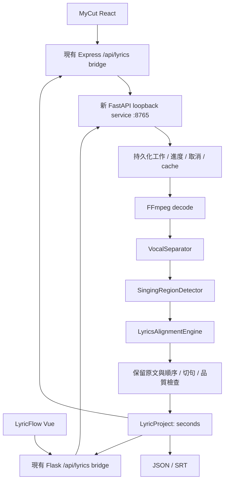

# Lyrics Timeline Engine 整合方案

> 此文件記錄原始規劃；現況已改為 MyCut 自帶本機原稿對齊引擎，沒有 LyricFlow 服務或 npm runtime 依賴。已實作與封裝流程請看 `LYRICS_ENGINE_INTEGRATION.md`。

日期：2026-09-29。依據 [CURRENT_ARCHITECTURE.md](CURRENT_ARCHITECTURE.md) 的實際程式盤點。本文件是實作前的方案，以下新增檔案、API、模型與行為皆尚未完成。

## 1. 交付順序與架構決策

先完成 Phase 1：`音訊 + 正確歌詞 → 聲學對齊 → Timeline JSON / SRT → 編輯與預覽`。現有 ASR／SRT／影片匯出照常可用。Phase 2 才統一 audio-only recognition；Phase 3 才做 Hybrid，V1 不顯示 Hybrid 入口。

採用 **獨立 Python AI Service + 共用 TypeScript contract + 各工具的薄轉接層**：



FastAPI 是新增服務，不取代 LyricFlow 的 Flask，也不改寫 MyCut 的 Express。Browser 繼續請求同源 URL；兩個 backend 呼叫固定的 loopback AI service，保留既有 CSP 與 Host／Origin 限制。

服務程式先放在 MyCut repository 的 `lyric-engine/`，可單獨安裝啟動；不匯入 MyCut 的 Project、React、Vue 或 LyricFlow 的 Flask。共用 TS package 放在 `packages/lyrics-timeline/`。不重組兩個既有 repository，也不另建全新的剪輯器。

## 2. 共用資料契約

建立版本 `1.0.0`，欄位沿用需求：

```typescript
interface LyricProject {
  version: string;
  duration: number;
  mode: 'auto_recognition' | 'known_lyrics' | 'hybrid' | 'import';
  segments: LyricSegment[];
}

interface LyricSegment {
  id: number;
  start: number;
  end: number;
  text: string;
  confidence?: number;
  words?: LyricWord[];
}

interface LyricWord {
  text: string;
  start: number;
  end: number;
  confidence?: number;
}
```

### 2.1 時間、ID 與驗證規則

- 所有引擎／交換資料時間皆為 **絕對秒數**；`word.start/end` 也以整份 Timeline 的零點為準，不是句內 offset。使用 `[start, end)` 顯示範圍。
- 引擎結果零點是上傳音訊開頭，`duration` 是該音訊的實際時長。套入剪輯專案後另產生專案時間版本；不可無標記地把兩種座標混用。
- `start/end/duration/confidence` 必須為有限數字；`0 <= start < end <= duration`；ID 為穩定、不重複的正整數。編輯刪除後不重排 ID；SRT 序號由 exporter 重新編號。
- confidence 若提供，範圍為 `0..1`，並在工作 metadata 記錄分數來源／意義。沒有模型分數就省略，不填 `1.0`；不把 `text_match_score` 當聲學信心。
- 已知歌詞 V1 為單一主唱、有序不重疊句子。既有多軌 SRT 的重疊仍由舊匯入流程支援；契約驗證要區分一般 import 與 known_lyrics 的品質要求。
- `words` 必須位於句子內、有序且有正長度，文字依原文順序；空白／標點附著於相鄰演唱單位，不創造假的零長度發音。無法完整對應時保留句子、取消該句 words 高亮。
- 秒數不在 adapter 往返時反覆四捨五入；SRT 才轉整數毫秒。極短區段若毫秒取整後起訖相同，回報可修正的 export validation error，不產生無效 SRT。

### 2.2 原文、正規化與未定位行

內部建立 `LyricsDocument`：保存完整 raw、每行原始 `displayText`、行號／字元 span、`normalizedText`、normalized token 到 display grapheme 的映射。繁簡轉換、標點移除、數字讀法或拼音只作用於模型輸入，不寫回原文。

預設 `preserve_lines=true`，忽略空白行作為字幕單位，但保留來源位置；不默認刪除方括號或其他文字。既有 Suno 標記清理只留在舊模式；新模式日後可提供明確選項。重複行各有獨立 ID 與全曲字元位置。

`preserve_lines=false` 在取得聲學位置後，按標點及確定的歌唱停頓分句，保留所有可顯示文字的原始順序；不能先平均分配每句時長來推算時間。

契約不把 `null` 或捏造的時間塞進 `segments`。工作回應另附 `AlignmentReport`：`status: complete | needs_review`、`unmatchedLines`、`warnings`、每句品質與 normalized/display 映射診斷。未定位歌詞仍留在工作與編輯器的「待校時」區；只有取得有效時間的行可進 Timeline。不能把有漏句的結果顯示成「全部對齊完成」。

## 3. Alignment 技術評估與第一個實驗

### 3.1 查核過的一手來源

以下是候選評估，不是本機模型驗證結果。資料於 2026-09-29 查核。

| 方案 | 已確認事項 | 本案判斷 |
| --- | --- | --- |
| 中文 Wav2Vec2 CTC | 中文 XLSR 模型輸入 16 kHz，model card 標示 Apache-2.0；訓練來自 speech corpora。[模型卡](https://huggingface.co/jonatasgrosman/wav2vec2-large-xlsr-53-chinese-zh-cn) | 第一個 CPU baseline；已知文字限制 CTC 路徑，不需要 ASR 解碼歌詞。歌曲表現需另測。 |
| WhisperX alignment | 官方程式有 `zh` align model；使用各輸入 segment 的 start/end 裁音訊，失敗時可退回原始時間。[alignment.py](https://github.com/m-bain/whisperX/blob/main/whisperx/alignment.py) | 可參考其字元對齊，不能把假定的逐句時間直接交進去，再當成全曲精準定位。需識別失敗回退。 |
| Qwen3-ForcedAligner-0.6B | 可獨立輸入 audio、text、language；支援中文，模型卡說明最多 5 分鐘 speech、Apache-2.0。[模型卡](https://huggingface.co/Qwen/Qwen3-ForcedAligner-0.6B)、[官方範例](https://github.com/QwenLM/Qwen3-ASR/blob/main/examples/example_qwen3_forced_aligner.py) | 作對照候選；ASR 模型支援歌曲不等於 ForcedAligner 已證明歌曲精度。CPU／macOS x64 依賴相容性未測，不能作唯一入口。 |
| MMS multilingual alignment | 官方示範包含 romanization／uroman 流程。[多語對齊文件](https://docs.pytorch.org/audio/2.8/tutorials/forced_alignment_for_multilingual_data_tutorial.html) | 需處理拼音與原文字元映射、同音字及模型授權，不直接假設能精準處理繁中歌唱。 |
| MFA phoneme alignment | 官方 Mandarin 模型用途為 speech forced alignment。[Mandarin model](https://huggingface.co/MontrealCorpusTools/mandarin_mfa) | 保留作 phoneme 方案；需字典／發音與歌唱長音適配，V1 不同時維護多套後端。 |
| Demucs | 原 Meta repo 已封存；作者 repo 表示維護有限，提供 CPU 執行與 vocals separation。[原始專案](https://github.com/facebookresearch/demucs)、[作者版本](https://github.com/adefossez/demucs) | 以獨立 adapter 評估，固定版本／權重 checksum，不能讓 API 綁死 Demucs。 |

TorchAudio 官方 2.9 文件確認舊 forced-alignment API 已移除；不能把網路舊教學與最新版依賴直接混搭。[官方文件](https://docs.pytorch.org/audio/2.9.0/tutorials/ctc_forced_alignment_api_tutorial.html)

中文歌唱研究亦採用針對演唱資料的適配，顯示 speech baseline 不能直接視為歌曲驗收通過。[Mandarin lyrics transcription and alignment 論文](https://arxiv.org/abs/2311.12488)

### 3.2 建議起點：獨立 CTC baseline，先驗證再選預設模型

第一個 spike 使用中文 Wav2Vec2 acoustic emissions，加上已知完整歌詞的單調 CTC forced path。只使用模型詞彙表與聲學分數；不先辨識文字再搜尋歌詞。選定 decoder 實作與依賴版本後，用人工標註與官方小例測試 blank／重複 token／失敗路徑。

CPU baseline 必須能在目前回報 `x86_64` 的 macOS runtime 載入及完成一首歌。使用隔離 venv，先驗證 Python／Torch／Transformers 的實際 wheel 相容性，再固定 lock；不要先要求使用者安裝 CUDA、FlashAttention 或 vLLM。CUDA／MPS 僅於該 adapter 的 smoke test 通過後啟用，失敗可回 CPU。

只有通過第 11 節的歌唱邊界測試才選為預設。若 CTC baseline 的長音／中文邊界不達標，優先比較獨立 Qwen ForcedAligner；超過其文件範圍的音訊需經已驗證的全局定位再切窗，不把整首歌詞重送到每個窗口。

這階段產出 CPU 時間／峰值 RAM／模型大小／精度報告；本文件不預估不存在的實測數字，也不承諾模型必然達標。

### 3.3 歌曲處理的必要規則

1. **前處理**：用 FFmpeg 解碼；人聲分離按模型所需聲道與採樣率輸入，之後才轉為 aligner 所需 mono／sample rate。檢查輸出長度／padding，保留精確 offset，不移除前奏後忘記補回。
2. **分離**：`VocalSeparator.separate(audio, context)` 回傳 vocals path、sample rate、duration、origin offset、實際模型版本。可支援原本就是 vocals 的 no-op provider，並清楚標記；失敗不得默默用混音冒充分離完成。
3. **歌唱區域**：`SingingRegionDetector.detect(vocals, context)` 產生候選區段與不確定區域。V1 可比較 vocals 能量／頻譜與 speech VAD，但門檻須用弱唱、氣音、拖長音及殘留伴奏驗證；不可把普通 RMS 當作已驗證 singing detector。
4. **全曲順序**：歌詞每個 token 含唯一的全局索引，forced path 只向前；不得每句從零開始搜尋。長曲以有重疊的聲學 inference chunks 產生 emissions，保留 core frame ownership；文字路徑跨 chunk，不按固定秒數均分歌詞。
5. **CPU 記憶體**：分塊推論、受控 batch；CTC trellis 用 rolling scores／checkpoint 回溯或經測試的 bounded 實作，避免把多分鐘 waveform 與完整 `T × U` 多份複製放記憶體。過大輸入以實測能力上限提早拒絕，不 OOM 後掛住 UI。
6. **間奏**：長 gap 允許停留於 blank。不得把音樂／未知 vocal 全部強行解釋為 lyric token；無支持、越界、反序或穿越確定間奏的句子標 review／unmatched。
7. **長音**：一個字可以佔多個 acoustic frames，最後壓成同一 word；不製造重複字幕。CTC blank 不全等於無聲，尾音邊界要用 vocals 證據交叉檢查，不能一律拉到下一句。
8. **切句**：先按原文 span 收集可信 word 邊界，再產生句子。跨確定間奏的一行應標 review；preserve_lines=false 才按合適文字位置拆開，不讓單一句子跨完整間奏常駐。
9. **失敗**：純伴奏＋歌詞、歌詞與歌曲不符、少唱／漏行、方言未支援都要有可見結果；不可為了輸出完整陣列而填等距時間。Phase 1 不自動呼叫 ASR fallback。

## 4. 模組與共用程式的落點

以下為預計新增結構。recognition／merger 留到各自 phase 才建立實作，V1 不放無作用的 stub 模型。

```text
packages/lyrics-timeline/
  package.json                    # 私有、framework-neutral、可 npm pack
  src/{model,validate,srt,editing,index}.ts
  schema/lyric-project.schema.json # 固定 wire contract
  fixtures/                       # TS / Python 共用 round-trip 與錯誤案例

lyric-engine/
  pyproject.toml
  main.py                         # 啟動 FastAPI，127.0.0.1:8765
  lyric_engine/
    api/{app,routes,jobs,events}.py
    models/{timeline,report}.py
    audio/{preprocess,separation,detection}.py
    alignment/{base,ctc,normalization}.py
    segmentation/phrases.py
    exporters/{json,srt}.py
    pipeline.py
    cache.py
    errors.py
    config.py
  tests/
  README.md

shared/lyrics-adapter.ts           # MyCut seconds ↔ clip projections
server/lyrics.ts                   # Express 同源 bridge、source snapshot
src/components/LyricsSourcePanel.tsx
scripts/verify-lyrics.ts
```

兩個 JS 專案使用同一個版本的 `@mycut/lyrics-timeline`，內容包含 runtime validation、SRT I/O 與純字幕編輯；不把 React component 搬給 Vue。初期透過 `npm pack` 的版本化 tarball 安裝並鎖定 hash，開發可用本機依賴；交付不能依賴作者 Desktop 的絕對路徑。Python 以相同 schema／fixtures 驗證 Pydantic 結構與 exporter，避免三份定義靜默分歧。

Python 抽象只涵蓋需要替換的模型邊界：`VocalSeparator`、`SingingRegionDetector`、`LyricsAlignmentEngine`；Phase 2 新增 `ASREngine`。回呼 context 提供 cancellation、progress、device、model revision。frontend 僅看到 capabilities 和標準結果，不寫死模型名稱或 import AI runtime。

## 5. API、進度與工作生命週期

### 5.1 Phase 1 service contract

| Endpoint | 行為 |
| --- | --- |
| `GET /health` | 服務版本、contract version、FFmpeg／模型／設備 readiness、支援 mode、實測輸入限制；服務在線與模型可用分開 |
| `POST /lyrics/align` | multipart：`audio`、UTF-8 `lyrics`、`preserve_lines`（預設 true）；預設 202 工作 |
| `POST /lyrics/align?wait=true` | CLI／後端可選同步等待，成功 200 `LyricProject`，以 `X-Lyrics-Job-Id` 提供 report 查詢；相同 pipeline 與 cache |
| `GET /lyrics/jobs/{id}` | 狀態、最新 progress、結果 URL、review／unmatched 數、結構化 error |
| `GET /lyrics/jobs/{id}/events` | SSE；每個 event 有單調 sequence ID，支援重連；查詢端點可補讀最新狀態 |
| `POST /lyrics/jobs/{id}/cancel` | 停止 worker／子程序群組；終止狀態不可被遲到結果覆蓋 |
| `GET /lyrics/jobs/{id}/result` | 完成／需校對的 `LyricProject` |
| `GET /lyrics/jobs/{id}/report` | 品質與未定位歌詞診斷，與核心 Timeline 分離 |
| `GET /lyrics/jobs/{id}/files/lyrics.json`、`lyrics.srt` | 同一完成版本的 JSON／SRT；未完成回 409，不回空白成功檔案 |

Browser 經兩個現有 backend 的 `/api/lyrics/*` 取得同等功能；service `/health` 對應 bridge `/api/lyrics/health`，不改動原 `/api/health`。

狀態為 `queued → running → completed | needs_review | failed | cancelled`；restart 將中斷中的工作標 interrupted／failed 並提供重試，不假稱可恢復模型內部運算。V1 單 worker，佇列有上限，工作持久化，不用 process-memory 的 background task 當唯一儲存。只取消自身工作；UI 卸載後不再套用結果。

每次成功工作會寫出 `lyrics.json`、`lyrics.srt`，檔案與 job state 原子提交；UI 提供下載兩者。使用者修改後從最新編輯狀態即時重新匯出，不能一直下載 backend 的原始結果當成已修改版。

### 5.2 Progress event

```json
{
  "job_id": "local-job-id",
  "sequence": 7,
  "stage": "alignment",
  "progress": 0.65,
  "stage_progress": 0.4,
  "message": "正在對齊歌詞"
}
```

階段固定為 `preparing_audio`、`separating_vocals`、`detecting_singing`、`alignment`、`segmenting`、`exporting`、`completed`。`progress` 是全工作 `0..1`，不等於目前階段百分比；模型載入等無法量化時 `stage_progress=null`，提供持續 heartbeat／階段描述。只有真正完成該步才前進，不用 timer 假裝分析完成。cache hit 明確顯示命中與略過的階段。

SSE 中斷可回復或改讀 job status；不可重新 POST 製造第二個分析工作。保留 job ID，支援 idempotency key 防止重複送出。

### 5.3 Errors

```json
{
  "code": "MODEL_LOAD_FAILED",
  "message": "無法載入歌詞對齊模型",
  "details": "設定的模型目錄缺少必要的權重檔",
  "suggestion": "請執行本機模型安裝指令，再重新分析。"
}
```

新增 `SERVICE_UNAVAILABLE`、`FFMPEG_NOT_FOUND`、`INVALID_AUDIO`、`INVALID_LYRICS`、`MODEL_NOT_FOUND`、`MODEL_LOAD_FAILED`、`OUT_OF_MEMORY`、`SEPARATION_FAILED`、`ALIGNMENT_FAILED`、`SOURCE_CHANGED`、`JOB_BUSY`、`JOB_INTERRUPTED`、`UNSUPPORTED_INPUT`。詳細 stack 留本機 log，HTTP 保留可診斷訊息。前端依 code 顯示處理方法與重試，模型錯誤不影響原 SRT／預覽／MP4 功能。

## 6. Cache 與本機 runtime

以內容而非檔名作 key，結果 cache 至少包含：

```text
SHA256(
  audio_content_hash + raw_lyrics_hash + engine_version + contract_version
  + separator_model_revision + aligner_model_revision
  + normalization_version + segmentation_version
  + preserve_lines + language + effective_options
)
```

原文標點／行分隔也進 lyrics hash，避免相同 normalizedText 回傳上次的顯示歌詞。分層保留 decode／vocals／emissions／alignment 結果：改歌詞時可重用 vocals，改 preserve_lines 時可重用聲學部分；模型或正規化版本改變時相應失效。

同 key 工作互斥，partial 不作 cache hit，完成後 rename；讀入時驗證 schema、時長、檔案完整性。使用者手動修改是專案資料，不能回寫原始分析 cache。提供有界容量／清除入口，活動工作不被清理。

開發預設 `.cache/lyrics-engine/`；桌面版改用可寫 userData 或服務資料目錄，不寫進 ASAR。模型首次安裝與實際分析分開，固定來源／版本／checksum，runtime 不臨時下載。不要複製整個 LyricFlow `.venv` 進 MyCut 安裝包。

V1 開發與本機服務採明確獨立啟動指令；兩個工具共用一個服務。health 不可用時說明如何啟動，不自動啟動另一個佔相同 port 的 worker。封裝自動管理服務時，必須有 owner PID／version handshake：只停止自己啟動的程序，共用服務仍被另一工具使用時不能關閉。CPU 可運作是發佈門檻；CUDA／MPS 為後續經測試的加速能力。

## 7. MyCut 整合細節

### 7.1 音訊來源與座標

V1 優先選取一首音訊／含音訊的片段，也支援直接選音檔。對原音檔做一次 alignment，套用時按目前 clip mapping 轉換：

```text
projectSeconds = clip.start / fps + (sourceSeconds - clip.sourceIn) / clip.speed
```

先裁到 clip 可聽見的 source 範圍，再映射句子與 words；無交集不插入。同一素材重複使用可重用一份來源 cache，但每次 occurrence 產生獨立 segment ID。新 source snapshot 包含 media content hash／revision、clip start／duration／sourceIn／speed 與 project ID。工作完成前使用者改動來源／專案時拒絕自動套用過期結果，保留結果供重新映射。

整個混音時間軸不是 Phase 1 的預設：若後續支援，沿用 `extractSpeechAudio()` 的混音／變速邏輯並記錄 render 起點，不能再套一次 sourceIn／speed。單歌曲與混音兩種來源要有清楚不同的 mapping。

### 7.2 保留秒精度，沿用現有影格剪輯器

全專案改成 seconds 會波及 keyframe、音畫變速與 MP4。新增歌詞使用以下受限擴充：

- Project 新增可選的 lyrics batch metadata（version、mode、duration、來源快照），與舊 version 1 相容。
- 新字幕 clip 新增可選的 `lyricSegment` 與 batch reference，內容直接是共用 seconds segment；`Clip.start/duration/text/karaoke` 是它的相容投影。
- `shared/lyrics-adapter.ts` 唯一負責投影／編輯同步；在 `App.update` 與字幕命令提交前協調，不維護第二份獨立可編輯 timeline store。undo／redo 保存完整快照。
- 匯入／秒數欄位直接保存原 seconds，投影 `startFrame=round(start*fps)`、`endFrame=round(end*fps)`；若 clip 無法形成至少 1 frame，回報可修正問題，不暗中改變精準來源。
- 拖曳以實際成功的 frame delta 更新 seconds；左右 trim 只改對應邊界；重新投影不把 seconds 改成 `frame/fps`。保持原始 fractional remainder，避免每次保存再量化。
- Preview／MP4 在影格格點呈現，正常邊界差上限為半影格；JSON／SRT 仍保留精準 seconds。舊 clips 沒有 `lyricSegment` 時維持原行為。
- words 投影為 clip-relative frames；若量化後某字不足 1 frame 或不再符合 `validWordTiming()`，原 words 留在共用 JSON，該 clip 使用 sentence fallback。禁止偽造延長的逐字時間。

新增 `applyLyricProject()` 使用 `insertTimedClips()` 建立獨立 Subtitle Track，不呼叫 append、不修改圖片、影片或音訊排列。批次 ID／segment ID 與 MyCut UUID 各司其職。32 軌、20,000 clips、鎖軌與來源過期檢查先完成才一次提交。

### 7.3 編輯一致性

文字／開始／結束／播放一句／定位／合併／分割／刪除皆進入同一個字幕命令層：

| 操作 | seconds／words 規則 |
| --- | --- |
| 移動整句 | start/end/words 同加 delta |
| 裁切起訖 | 保留有效範圍；若裁到演唱字導致文字不再完整對應，清除該句高亮並提示校時，不拉伸 words |
| 改文字／批次取代 | 保留新顯示文字；使不再相符的 words 失效，移除舊自動 confidence，回 sentence mode |
| 合併 | 相鄰且同 batch／track，文字完整拼接；有效 words 接合，不平均分攤間隔；長間奏跨句合併提示人工選擇 |
| 分割 | 有有效 words 可在 word 邊界分配原文；否則要求文字切點與時間切點，不沿用一般 clip split 的兩份完整文字 |
| 複製 | 新 UUID、新 segment ID；時間平移與 words 一起更新，不與原句共用可變資料 |
| 刪除／復原／重做 | 同一歷史交易更新 clip 投影及其 seconds segment |

`KaraokePanel` 手動打點也必須回寫 seconds words，不能只修改舊 karaoke 欄位。舊 `source` enum 需新增 alignment 來源，UI 不再把它誤稱 Whisper。

播放一句用原播放器設定播放範圍，在該句 end 停止；seek／切換專案／取消播放要清除範圍。匯出「此歌詞軌 JSON／SRT」只讀最新該批資料；原本匯出所有 text 的 SRT 功能仍保留。

## 8. LyricFlow 整合細節

- 新增 `web/src/domain/lyricsTimeline.ts` adapter 與 `useLyricsAlignment.ts`，呼叫同源 `/api/lyrics/*`，不把結果先轉 SRT 再匯入。
- 對新字幕建立結構化 `LyricProject` 狀態，`useSubtitleEditor` 使用它的 segments；UI 的 `uid/animType/subText/thirdText` 保存在 presentation metadata，不能污染聲學 normalized text。
- `useLyrics.raw` 作舊 SRT／LRC／手動打點相容入口；匯入時一次 parse → canonical，匯出時 canonical → SRT／LRC。編輯 raw 時一次替換／遷移，未能保留的逐字資料明確失效，避免 watcher 來回覆蓋。
- `useStudio` 的 renderer、字幕時間軸、SRT／JSON exporter 與 draft capture 都讀相同版本，不再以 parse raw 的結果覆蓋 words。
- `ProjectManifest` 新增 version 2 與 `lyricProject`／presentation metadata；`validateManifest/unpackProject` 保留 version 1 migration。保留既有媒體、設定、裁切、音量、場景、字幕第二／第三行。
- IndexedDB payload、draft 恢復、undo snapshots 都要包含 words；新增欄位不能只在記憶體可用。更新 `useMediaSequence` 的字幕連動 snapshot，避免音軌移動時仍只改 raw 字串。
- source mapping 沿用 `project = source - trimStart + clip.start`；UI 要逐一映射 segment 與 word，再檢查 occurrence IDs；來源修改時阻擋過期套用。
- `drawLyrics` 增加由絕對 word 時刻與 grapheme span 控制的 highlight mask；底層文字仍正常繪製。無 words／words 無效時完整句子照常顯示，現有動態文字及 Karaoke ball 可保留作視覺效果。
- 句子模式在間奏依 `[start,end)` 隱藏。原 list-left 的整份歌詞瀏覽屬既有顯示選項，不應把列表仍可見誤判為目前正在演唱。
- 新來源套用只提交字幕。不得呼叫 `applyImageSubtitleArrangement()` 或建立 Scene；既有 V1 clips／圖片順序不變。自動圖片模式先保存既有的圖片節奏安排，字幕更新不偷偷重新推算；保留使用者日後明確重算的入口，並在專案／草稿保存此安排。
- 既有自動辨識（ASR 文字匹配）在新功能驗收前保留為舊入口，名稱標示其處理方式；不能把同一舊算法改標「精準 forced alignment」。純靜態版繼續支援 import／edit／export，local AI 模式顯示需本機版。

### 8.1 兩端一致的來源與編輯介面

兩端都使用「歌詞／字幕來源」：`AI 自動辨識`、`正確歌詞精準對齊`、`匯入 SRT`。MyCut 的 AI 選項繼續使用既有辨識；LyricFlow 在 Phase 2 前不可把需要歌詞的舊匹配當成 audio-only AI，該新來源先顯示尚未提供，舊入口仍可使用。Hybrid 不出現在一般使用者選單。

精準模式顯示歌曲檔名、正確歌詞輸入框、預設開啟的「保留每行歌詞」與「分析並對齊歌詞」。送出後鎖定本次來源快照，顯示整體進度、目前階段與取消；失敗保留輸入及原字幕。套用會取代已有字幕時沿用既有確認，對新增獨立字幕軌不增加不必要的確認步驟。

完成後列出 `00:14.700 → 00:19.900`、原文與需校對標記；開始／結束欄位可直接輸入秒數。每句可播放／定位；選取後提供合併、文字與時間分割、刪除；JSON／SRT 下載與預覽使用同一編輯版本。UI 不展示 Python module、模型參數或內部 normalizedText。

## 9. 預計修改檔案

### 9.1 MyCut

| 檔案 | 變更 |
| --- | --- |
| `package.json`、`package-lock.json` | 固定共用 package；新增 service／驗收指令，模型依賴留 Python |
| `shared/model.ts` | 可選 seconds segment／batch metadata；舊專案相容；字幕 split 轉交專用命令 |
| `shared/karaoke.ts` | alignment 來源與 seconds adapter 協作，保留共用繪製與 fallback |
| `shared/editing.ts`、`shared/caption-batch.ts` | 新字幕移動、trim、split、duplicate、文字變更同步，既有 clips 行為不變 |
| `src/App.tsx` | 套用、歷史交易、來源快照、當前歌詞 JSON／SRT、播放範圍 |
| `src/components/CaptionPanel.tsx`、`LibraryPanel.tsx` | 字幕來源入口與既有 AI／SRT 功能整合 |
| `src/components/Inspector.tsx`、`CaptionProperties.tsx`、`KaraokePanel.tsx` | seconds 編輯、播放單句、逐字修正回寫 |
| `src/components/Timeline.tsx` | 字幕 merge／split 入口，拖曳沿用既有 gesture 系統 |
| `src/components/Preview.tsx` | 句子播放截止點；沿用現有渲染與音訊同步 |
| `server/index.ts` | 註冊 bridge、關閉服務時取消自己持有的請求 |
| `.gitignore` | Python venv／engine cache／模型檔與測試輸出 |
| `README.md`、`THIRD_PARTY_NOTICES.md` | 啟動、模型安裝、資料位置、能力限制與授權來源 |

新增：第 4 節的 package、Python service、`shared/lyrics-adapter.ts`、`server/lyrics.ts`、`LyricsSourcePanel.tsx`；`tests/lyrics.test.ts`、`tests/ui/lyrics-alignment.spec.ts`、`scripts/verify-lyrics.ts` 與共用 fixtures。

`server/render.ts`／`karaoke-render.ts` 原則沿用；由 adapter 投影與匯出回歸驗證決定是否需要小幅調整。服務自動封裝另外修改 `electron/main.cjs`、`scripts/package-desktop.mjs` 與 resources manifest，不混進首個模型精度 spike。

### 9.2 LyricFlow

| 檔案 | 變更 |
| --- | --- |
| `lyricflow/factory.py` | 加入新的 service client／blueprint，保留原 service |
| 新 `lyricflow/lyrics_engine_client.py`、`lyrics_engine_routes.py` | 固定 loopback bridge，上傳串流、progress、cancel、錯誤映射 |
| `web/package.json`、`web/package-lock.json` | 安裝同版本共用 package |
| 新 `web/src/domain/lyricsTimeline.ts` | 核心與 UI presentation adapter |
| 新 `web/src/composables/useLyricsAlignment.ts` | 新 mode 的 job／SSE／來源生命週期 |
| 新 `web/src/components/lyrics/LyricsSourcePanel.vue` | 相同來源概念的 Vue UI |
| `useLyrics.ts`、`useSubtitleEditor.ts`、`useStudio.ts` | 結構化字幕、raw 相容視圖、words、共用編輯 |
| `useMediaSequence.ts`、`domain/autoImages.ts` | 字幕連動同步 canonical；保護原圖片節奏安排 |
| `domain/project.ts`、`useProject.ts`、`useProjectDraft.ts`、`services/projectDraft.ts` | schema v2、v1 migration、草稿完整保存 |
| `components/lyrics/SubtitleTimeline.vue`、`CaptionList.vue`、`LyricsEditor.vue` | merge／split／JSON／秒數／未定位列 |
| `components/player/AutoRecognition.vue`、`MediaToolbar.vue` | 舊模式與新入口的明確區別，保留 SRT 與原工作流程 |
| `useAudioPlayer.ts` | 播放單句截止時間 |
| `engine/resources.ts`、`frame.ts`、`passes/drawLyrics.ts`、`textBitmap.ts` | 傳遞 words、逐字 mask、無 words fallback |
| `config/features.ts` | 靜態版能力邊界 |
| 相關 unit／E2E、`API.md`、`ARCHITECTURE.md` | 契約、migrations、取消、既有功能回歸 |

舊 `alignment.py`／`recognition.py`／`repair.py` 保留，不改成新服務的隱藏前置依賴。`lyric_flow_client.py` 的既有 SRT API 相容；新 Timeline client 可獨立提供。

本次兩份文件都寫在 MyCut；LyricFlow 本次僅讀取與驗證，未修改其程式。

## 10. 分段實作，每段可驗收

| 順序 | 交付 | 通過條件 |
| --- | --- | --- |
| 1A | 共用 contract／JSON／SRT、兩端 adapter 純函式 | 原文、秒數、words、ID、round-trip 與非法輸入測試 |
| 1B | 真實聲學模型 spike，CLI 輸出 `lyrics.json/srt` | CPU 跑完中文歌曲，人工邊界評量，不使用 stub 時間 |
| 1C | FastAPI、持久 job、階段事件、cancel、cache、錯誤 | 服務重啟／取消／同 key 重用／壞音檔／缺模型可重現 |
| 1D | MyCut 套用字幕軌與修正／保存 | 拖兩端、文字、split／merge、播放句子；原圖像排列不變 |
| 1E | LyricFlow 結構化字幕與同源 bridge | JSON 無損、words fallback、草稿／專案 round-trip、圖片節奏保護 |
| 1F | 跨工具與 CPU 發佈驗收 | 第 11 節通過後才稱 V1 完成 |
| 2 | `ASREngine`、`POST /lyrics/transcribe` | audio-only 產生 `auto_recognition`；confidence／words 如實保留 |
| 3 | `POST /lyrics/hybrid`、Timeline merger | 原文永遠取 known lyrics，forced timing 優先，失敗句才用有證據的 ASR timing |

Phase 2／3 尚未提供時 `/health` 明確列出不支援；不要回傳空的成功 Timeline 或把 `/transcribe` 偷轉 `/align`。Hybrid 只做時間補位／邊界參考，不以 ASR 文字改寫歌詞。兩條支線各自可跑、可測、可失敗，不互相綁死。

## 11. V1 驗收與實測方法

### 11.1 不能省略的真實歌曲測試

採使用者指定、可本機使用的 `song.mp3 + lyrics.txt`，另由人工聽音建立句首／句尾標註。不要從模型輸出生成「標準答案」。目前附件沒有指定一組驗收音檔與歌詞；不任意選私人歌曲當基準。

最少覆蓋：15 秒以上前奏、30 秒以上間奏、重複副歌、拖長尾音、弱人聲／重伴奏、繁中標點與混合英文；另測純伴奏、不符歌詞、少唱一行及只唱部分歌曲。重複副歌核對 occurrence，不能只確認句數或文字吻合。

建議採用的初始工程門檻（待實際歌曲評量確認，不是現有能力聲明）：

- 標準歌曲完整保留所有演唱句與順序；已對齊句起／訖的絕對誤差分開統計，median ≤ 150 ms、P95 ≤ 350 ms；任何 > 1 秒或副歌位置錯置列為失敗並展示。
- 人工標註的純前奏／間奏核心區域沒有 active 句子；不以整段平均誤差掩蓋。
- 不確定句有明確 review／unmatched，輸出 coverage 與漏句率；低 confidence 不能靠不輸出難句來提高準確度。
- CPU 完成整首，記錄硬體、依賴／模型 revision、時長、wall time、峰值 RAM、cache hit 第二次耗時。CPU 執行、macOS x64／arm64、Windows x64 分開記錄通過狀態。

### 11.2 自動測試矩陣

| 層級 | 重點 |
| --- | --- |
| Contract | seconds、有限數值、越界／反序、重複 ID、缺 words、confidence 非必填、版本不符 |
| 原文 | 繁簡／標點／空白／emoji grapheme／數字、空行、重複句、preserve_lines 開關 |
| 聲學路徑 | CTC blank、相鄰重複 token、跨窗 offset、長音、no-path、unsupported token，不均分輸出 |
| Export | 一小時以上時間、BOM／CRLF、多行、JSON→SRT→parse 的毫秒誤差、無效極短區段 |
| MyCut | 24／25／30／50／60 fps、sourceIn／speed、clip 多次 occurrence、source changed、鎖軌／32 軌上限、精準秒數多次保存不漂移 |
| 編輯 | move／兩端 trim／文字／merge／split／duplicate／刪除／undo／redo 後 JSON、SRT、preview 一致；words 失效只回 sentence mode |
| LyricFlow | 不經 SRT 中轉保存 words；raw 輸入轉換；v1→v2；`.resonance`、IndexedDB 草稿、字幕連動 snapshot |
| 保留圖片 | 套用前後 MyCut 非字幕 clips 深比較；LyricFlow V1 clips、圖片順序、auto 切換時間也比較 |
| API | 上傳中斷、超限、損壞音檔、模型不存在、OOM、分離失敗、取消／關閉、SSE 斷線、stale result、cache key 失效 |
| Preview／MP4 | 句子開始前／開始／結束畫面、word highlight、無 words fallback、seek 重播、原音訊與特效不變 |

沿用 MyCut `npm test`、`npm run typecheck`、相關 Playwright／`test:karaoke`／`test:export`；LyricFlow 使用現有 Python tests、typecheck、Vitest、recognition／project／draft／timeline E2E。Mock 只驗證 UI 與生命週期，不能取代 1B 的聲學實測。

### 11.3 最終操作驗收

1. 在兩工具選「正確歌詞精準對齊」，選歌曲、貼入原歌詞。
2. 按「分析並對齊歌詞」，看到準備音訊 → 分離人聲 → 分析歌唱區域 → 對齊 → 產生時間軸的真實階段。
3. 得到同一 contract 的 `lyrics.json` 與 `lyrics.srt`，看到未定位／需校對的句子。
4. MyCut 建立獨立字幕軌；LyricFlow 顯示對應句子。原圖片安排保持不變。
5. 改文字、起訖，拖左右邊界，播放一句、定位、合併、分割、刪除，確認當前 JSON／SRT／Preview 同步。
6. 保存、關閉、還原，時間與 words 不丟失；有 words 使用逐字高亮，無 words 正常逐句顯示。
7. 匯出 MP4 並抽查聲畫同步；再次分析未變動歌曲／歌詞確實命中 cache。

完成以上並留下實測報告後，才宣告 Phase 1 完成。LLM 改寫、翻譯、MV 分鏡、圖片／影片生成、帳號、雲端、歌詞資料庫與多人協作均不在此方案內。
