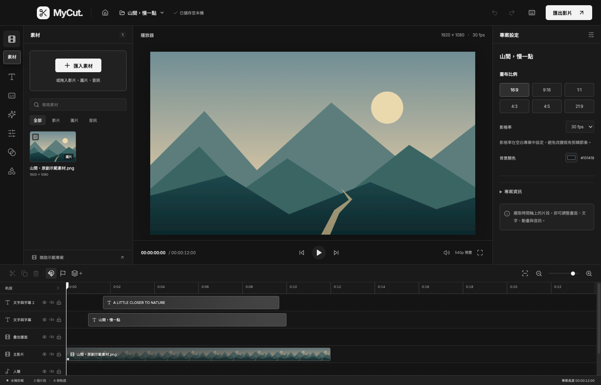
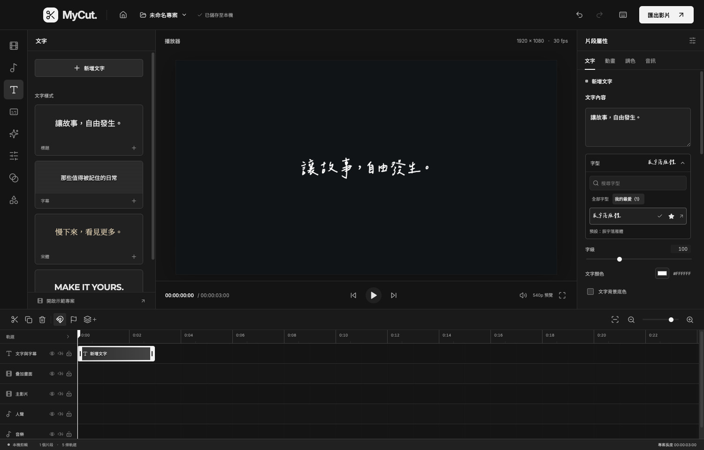

# MyCut

**Mac／Windows 本機多軌影片剪輯器 · v0.6.11**

從專案管理、影片剪輯、文字與特效，到自動字幕、卡拉 OK 歌詞與 MP4 匯出，均在本機完成。內建 40 款可商用字型、40 種特效與離線語音模型，不需帳號或 API 金鑰。本專案不包含 AI 產圖或影片生成功能。


[安裝](#安裝與開啟) · [快速開始](#快速開始) · [功能](#功能一覽) · [字幕與歌詞](#自動字幕與自動歌詞) · [字型](#40-款字型與授權) · [開發](#開發與建置) · [驗證](#測試與驗證狀態)

## 0.6.11 新增 12 種特效

泡泡、漂浮愛心、蝴蝶、彩色紙花、流動絲帶、晨光射線、十字星芒、底片顆粒、像素風、漫畫網點、電影黑邊、節奏放射線，總數增至 40 種。每種都有獨立示意圖，支援全片套用與時段特效、復原及專案儲存。操作仍是左側選擇效果、右側調整參數。

新增效果使用絕對時間與固定種子，粒子數有上限；像素風重用暫存畫布，漫畫網點最多讀取 96×96 像素。長片逐格串流，不保留歷史影格。

[新增特效美術](docs/artwork-effects-new.png)

## 0.6.10 左側功能、右側屬性

左側集中新增、匯入、辨識、批次操作與效果選擇；右側調整選取內容的文字、樣式、時間與參數。全片特效的品質、強度、密度、色彩與頻譜設定移到右側，時段特效仍調整各自片段。分離音訊移至左側「音訊」，所選歌詞的逐字 LRC 匯出移至左側「字幕」。

移除重複的預設文字／字幕樣式入口；縮放、位置與不透明度只在右側「基本／文字」調整，音量只在「音訊」分頁顯示。沒有聲音的片段不顯示音訊分頁。

## 0.6.9 字幕屬性簡化

右側分頁改為「字幕」在前、「文字」在後。「字幕」只保留搜尋與字幕清單，移除片段名稱、「字幕功能」與「目前字幕」編輯區。選取字幕後切換「文字」，集中編輯內容、字型、時間與歌詞校時；返回字幕清單保留搜尋與頁次。新增、辨識與批次操作仍由左側功能區開啟。

## 0.6.8 播放與字幕操作優化

靜態文字預覽會重用畫布，歌詞只在影格改變時重繪；字幕快取有固定上限，離開當前字幕即釋放。字型按目前畫面需要載入，編輯一句文字不再遍歷全片字幕載入字型。橫式、直式與方形預覽都限制在 960×540 範圍並保留比例。

字幕搜尋會在點選結果後保留，可用清除按鈕回到全部字幕；選取字幕會在清單內定位。時間軸標記點選與拖曳取消、離開編輯器時的手勢清理一併修正。

## 0.6.7 面板寬度與字幕屬性

拖曳播放器左右的分隔線，可調整功能區、播放器及屬性區的寬度；最小寬度分別為 220、400、240 像素。按兩下分隔線可重設該側寬度；Tab 聚焦後可用左右方向鍵調整。縮小視窗會自動保留最小寬度，同次開啟 App 期間切換專案保留配置。

選取文字片段，右側新增「字幕」分頁，按時間條列所有文字、字幕與歌詞。點選一列可定位，0.6.9 起切換「文字」修改內容；支援搜尋，每頁最多 50 則。原有「字幕功能」在 0.6.9 移除，操作入口保留於左側功能區；卡拉 OK 高亮和逐字校時改放右側「文字」。時間軸直接顯示文字內容，修改後立即更新；空白內容顯示「空白文字」。

## 0.6.6 文字接續與字型屬性

新增文字、字幕、圖形、時段特效及拖入素材，會接到目標軌道末端；播放頭在更後方時使用播放頭位置。拖曳與修剪會避開同軌片段，複製群組保留相對時間並接到後方。不同軌道可同時播放；已有時間碼的字幕與分離音訊遇到占用時分軌，交叉溶解也改用分軌淡化。

選取文字後，在右側「文字內容 → 字型」展開清單。每行用該字體顯示字型名稱，點選即套用到目前文字；星號可勾選最愛，保留搜尋、預設字型與授權下載。左側不再有獨立字型入口。

## 0.6.5 精簡介面

首頁直接顯示專案管理，左側功能列改為圖示；滑鼠停留約 0.35 秒會顯示功能名稱，支援的快捷鍵也會一起提示。鍵盤 Tab 聚焦時同樣顯示，Esc 可關閉提示。特效參數自 0.6.10 起統一放在右側屬性區，時間軸群組／連動操作依選取內容顯示，字型面板保留搜尋、最愛與預設資訊。

## 0.6.4 字型與我的最愛

擴充至 40 款字型（10 款繁中、30 款英文）。字型選單可搜尋、勾選我的最愛與查看預設字型；最愛依列表順序的第一款作為預設，初次或未勾選時使用第一款「思源黑體 TC」。設定儲存在本機，重啟程式及新建專案均保留。

## 0.6.3 關閉編輯器返回首頁

在編輯器按 Mac 紅色關閉鈕、Windows X 或關閉視窗快捷鍵，會先儲存專案，再回到檔案管理首頁。儲存失敗時保留編輯畫面；匯出與辨識工作持續在背景執行。

## 0.6.2 一鍵建立專案

首頁點「建立新專案」，直接建立「未命名專案」並進入編輯器，預設 16:9（1920 × 1080）、30 fps。

## 0.6.1 介面更新

介面採黑灰＋白色：首頁、側欄、時間軸、特效、字幕與匯出視窗使用一致的中性色。白色主要按鈕、選取框及鍵盤焦點，搭配灰階面板層次；影片、素材與特效示意圖保留原色。

## 0.6.0 新增功能

- **完整專案包**：桌面版可將剪輯設定與用到的原始素材打包為 `.mycutpack`，在另一個本機資料庫還原；逐檔串流、SHA-256 校驗、進度與取消。
- **多選、群組與音畫連動**：框選、Shift／Command／Ctrl 點選增減，多片段一起移動、修剪、分割、複製及刪除；分離音訊後自動連動。
- **時段特效**：獨立特效軌、片段長度、淡入淡出與強度關鍵影格，預覽和原生匯出共用設定。
- **字幕批次編輯**：依範圍與文字篩選，搜尋取代、標點整理、每行字數、統一樣式、同軌重疊提醒；先預覽再儲存，一次復原。

操作範例與限制見 [0.6.0 工作流程指南](docs/workflow-guide.md)。

## 安裝與開啟

### 系統與版本

| 平台 | 目標系統 | v0.6.11 驗證狀態 |
| --- | --- | --- |
| Mac Intel（x64） | macOS 14 以上 | 已通過封裝檢查與本機原生執行測試 |
| Mac Apple Silicon（arm64） | macOS 14 以上 | 已完成封裝與架構檢查，實機執行待驗證 |
| Windows Intel／AMD（x64） | Windows 11 | 已完成封裝與架構檢查，實機執行待驗證 |

x64 語音引擎需要支援 AVX2 的處理器。Windows ARM／Snapdragon 不在本版支援範圍。Mac 目前使用 ad-hoc 簽章，尚未做 Apple 公證；Windows 尚未加入發行者簽章。

### 使用封裝版本

目前本機 `release/` 已產生下列檔案；該資料夾不納入 Git。若拿到的只有原始碼，請依照[開發與建置](#開發與建置)產生應用程式。

| 使用環境 | `release/` 中的檔案 | 開啟方式 |
| --- | --- | --- |
| Mac Apple Silicon | `MyCut-0.6.11-macOS-arm64.zip` | 解壓縮，將 `MyCut.app` 移至「應用程式」後開啟 |
| Mac Intel | `MyCut-0.6.11-macOS-x64.zip` | 解壓縮，將 `MyCut.app` 移至「應用程式」後開啟 |
| Windows 安裝版 | `MyCut-0.6.11-Windows-x64-Setup.exe` | 執行安裝，可選安裝位置；完成後由桌面或開始功能表開啟 |
| Windows 免安裝版 | `MyCut-0.6.11-Windows-x64.zip` | **完整解壓縮**，執行資料夾中的 `MyCut.exe`，保留旁邊所有資源與 DLL |

封裝版已包含 FFmpeg、語音引擎、約 190 MB 的模型及字型，**不需另外安裝 Node.js，也不需首次連線下載模型**。檔案校驗值放在 `release/SHA256SUMS.txt`。

在已完成封裝的專案資料夾中，也可雙擊 `啟動 MyCut.command`（Mac）或 `啟動 MyCut.cmd`（Windows）。Mac 啟動器會優先選擇本機架構；應用程式分別位於 `release/mac/MyCut.app` 與 `release/mac-arm64/MyCut.app`。

平台差異、封裝細節與測試範圍見[跨平台版本說明](docs/cross-platform.md)。

## 快速開始

1. **從首頁建立或開啟專案。**點「建立新專案」會立即建立「未命名專案」（16:9、1920 × 1080、30 fps）並進入編輯器；「從影片開始」可選影片、音訊或圖片，直接建立時間軸；「開啟專案檔」可讀取 `.mycut.json`／`.mycut`；桌面版也可直接開啟完整的 `.mycutpack`。
2. **匯入與剪輯素材。**將素材加入時間軸，拖曳調整位置、拉動邊緣修剪；選取片段後可分割、變速、音畫分離或調整畫面與音量。
3. **加入文字、濾鏡與特效。**從左側選單選擇功能，並在右側調整選取片段的屬性。特效可選「全片效果」或「時段特效」；後者在播放頭或特效軌末端（取較後者）加入可裁切的片段。
4. **製作字幕或歌詞。**在左側「字幕」啟動自動辨識，完成校對後加入時間軸；歌詞可進一步設定逐字高亮與校時。
5. **匯出影片。**選擇解析度與編碼器，加入匯出佇列；完成後另存 MP4。匯出支援暫停、續跑與重啟恢復。

首頁支援搜尋、重新命名、複製、回收區與還原。編輯器左上角的房屋圖示（返回專案首頁）會先儲存再返回。桌面版素材以原始檔案參照讀取，剪輯期間請保留來源檔案；專案 JSON 不包含素材，詳見[資料與備份](#資料與備份)。



## 功能一覽

| 類別 | 已實作功能 |
| --- | --- |
| 專案 | 首頁管理、自動儲存、上一版備份、JSON 匯入／匯出、完整素材打包／還原、80 步復原／重做、遺失素材重新連結 |
| 時間軸 | 最多 32 軌、框選多選、群組、音畫連動、跨軌拖曳、修剪、分割、複製、刪除、同軌漣漪刪除、磁吸、標記、縮放與全片檢視；軌道鎖定、隱藏、靜音 |
| 片段 | 0.25×–4× 等速變速並保留音高、音畫分離、位置、縮放、旋轉、翻轉、置中裁切、完整顯示／填滿、透明度 |
| 動畫與轉場 | 位置、縮放、透明度的線性關鍵影格，淡入、淡出與交叉溶解 |
| 文字與字幕 | 多行文字、40 款本機字型與我的最愛、文字顏色與背景、SRT 匯入／編輯／匯出／燒錄、自動字幕與歌詞、字幕批次編輯、卡拉 OK 高亮、逐字校時及 LRC 匯出 |
| 畫面 | 40 種特效、8 組調色預設、亮度／對比／飽和度／模糊、色度去背、矩形與圓形疊圖 |
| 音訊 | 音量、淡入淡出、立體聲混音、限幅、匯出時穩態噪音抑制、麥克風旁白錄音 |
| 預覽 | 540p 代理檔、素材縮圖、音訊波形；匯出使用原始素材 |
| 專案格式 | 16:9、9:16、1:1、4:3、4:5、21:9；24／25／30／50／60 fps，影格率於空白專案設定 |
| 匯出 | 720p／1080p／4K MP4，H.264 + AAC 48 kHz；分段匯出、佇列、暫停續跑、時長檢查 |

Mac 可使用軟體編碼或 Apple VideoToolbox；Windows 目前使用 libx264 軟體編碼。高解析度、多層合成及特效數量都會影響處理時間。

### 40 種特效與示意美術

| 類別 | 特效 |
| --- | --- |
| 氛圍（14） | 懷舊濾鏡、櫻花、雨絲、精靈粒子、螢火蟲、飄雪、落葉、蒲公英、火星／餘燼、星空／流星、泡泡、漂浮愛心、蝴蝶、彩色紙花 |
| 光影（11） | 散景、暗角、漏光、霧氣、極光、環境光暈、柔光 Bloom、光線掃過、流動絲帶、晨光射線、十字星芒 |
| 節奏（7） | 節奏閃光、節奏色偏、節奏煙火、節奏震動、音樂頻譜、節奏波紋、節奏放射線 |
| 畫面（8） | VHS 錄影帶、萬花筒、鏡像、雨滴玻璃、底片顆粒、像素風、漫畫網點、電影黑邊 |

左側選擇特效後，在右側屬性區調整品質、強度、速度、密度與色彩；音樂頻譜使用實際音訊 FFT，可切換直條、環形或波形。**全片效果套用整段專案；時段特效只在特效片段內生效，可裁切、淡化與設定強度關鍵影格。兩者都作用於合成畫面，包含文字與字幕。**濾鏡則調整選取的畫面片段。

內建 53 張原創 SVG 示意圖，涵蓋 40 種特效、5 張轉場卡片與 8 組濾鏡。插畫只用於介面，不會加入匯出影片。

[特效美術](docs/artwork-effects.png) · [轉場美術](docs/artwork-transitions.png) · [濾鏡美術](docs/artwork-filters.png) · [美術資源說明](public/artwork/README.md)

## 自動字幕與自動歌詞

1. 將有聲素材加入時間軸，點左側「字幕」，選擇「自動字幕」或「自動歌詞」。
2. 選擇辨識範圍（整個時間軸／目前片段）與音訊語言，按「開始辨識」。中文可轉換為繁體。
3. 完成後按「校對與加入」，修改文字與起訖時間，再加入獨立文字軌。
4. 選取歌詞片段，在右側「卡拉 OK 歌詞」調整高亮顏色，或用「逐字校時」播放打點、手動修正時間。

內建 **whisper.cpp 1.8.6 + 多語言 Whisper Small Q5_1**，以本機 CPU 離線辨識。歌詞模式提供較短斷句及可關閉的人聲頻段濾波；未包含專業人聲分離，重伴奏、合唱與特殊唱腔仍需人工校對。

自動歌詞預設啟用逐字高亮，使用 DTW 聲學對齊估計字詞時間。中文單位可能包含數個字，可「按字重新分段」後手動校時；無有效時間的句子保留為一般字幕。支援 SRT、一般 LRC 與逐字 LRC 匯出。

辨識按 30 秒區段執行，一次處理一個工作，支援暫停與重啟續跑。進度在區段完成後更新；更動音訊時間軸後，舊結果會阻擋套用，需重新辨識。

校對流程、時間對齊及輸出方式見[編輯與長片處理指南](docs/editor-guide.md#自動字幕與自動歌詞)。

## 40 款字型與授權



| 類別 | 字型 |
| --- | --- |
| 繁體中文（10） | 思源黑體 TC、思源宋體 TC、霞鶩文楷 TC、jf open 粉圓、芫荽、可可黑體、昭源黑體、昭源宋體、昭源環方、辰宇落雁體 |
| 英文（30） | Inter、Roboto、Open Sans、Montserrat、Poppins、Lato、Oswald、Raleway、Playfair Display、Merriweather、Bebas Neue、Caveat、Pacifico、Space Grotesk、DM Sans、Manrope、Outfit、Plus Jakarta Sans、Nunito、Quicksand、Barlow、Work Sans、Libre Baskerville、Lora、Cormorant Garamond、Anton、Righteous、Patrick Hand、Dancing Script、JetBrains Mono |

以上字型均隨附 **SIL Open Font License 1.1** 與版權聲明，可用於商業影片。英文字型缺少的中文字由思源黑體 TC 補上。來源、檔案與 SHA-256 記錄於[字型清單](public/fonts/manifest.json)，各字型目錄保留 `OFL.txt`；文字屬性的字型清單也可下載授權。

「我的最愛」的預設套用於新增一般文字、手動字幕、SRT 匯入、自動字幕與自動歌詞；批次樣式選單也先選此字型。已存在的片段保留原字型；點選字型名稱會修改目前文字的字型；新增「宋體／英文標題」樣式時採用樣式指定的字型。多個最愛依全部字型列表的排列順序決定預設，不依勾選先後。個人設定位於資料目錄的 `preferences.json`，不隨專案包傳送。

字型授權與程式依賴的授權各自適用。FFmpeg、whisper.cpp、Electron 等第三方元件與再散布事項，請見[第三方聲明](THIRD_PARTY_NOTICES.md)。

## 快捷鍵

以下在編輯畫面生效；輸入文字或開啟對話框時不攔截編輯快捷鍵。

| 動作 | Mac | Windows |
| --- | --- | --- |
| 播放／暫停 | `Space` | `Space` |
| 全選片段 | `⌘ A` | `Ctrl A` |
| 群組／解除群組 | `⌘ G`／`⌘ Shift G` | `Ctrl G`／`Ctrl Shift G` |
| 增減選取 | `Shift`／`⌘` 點選，或框選 | `Shift`／`Ctrl` 點選，或框選 |
| 分割選取片段 | `⌘ B` | `Ctrl B` |
| 複製選取片段 | `⌘ D` | `Ctrl D` |
| 儲存專案 | `⌘ S` | `Ctrl S` |
| 開啟匯出 | `⌘ E` | `Ctrl E` |
| 復原 | `⌘ Z` | `Ctrl Z` |
| 重做 | `⌘ Shift Z` | `Ctrl Shift Z` 或 `Ctrl Y` |
| 刪除選取片段 | `Delete`／`Backspace` | `Delete`／`Backspace` |
| 同軌漣漪刪除 | `Shift Delete`／`Shift Backspace` | `Shift Delete`／`Shift Backspace` |
| 前後一影格／一秒 | `←`、`→`／加 `Shift` | `←`、`→`／加 `Shift` |
| 加入標記／快捷鍵說明 | `M`／`?` | `M`／`?` |

## 資料與備份

| 執行方式 | 預設資料位置 |
| --- | --- |
| 原始碼開發版 | 專案目錄下的 `.mycut/` |
| Mac 封裝版 | `~/Library/Application Support/MyCut/workspace/` |
| Windows 封裝版 | `%APPDATA%\MyCut\workspace\` |

桌面版可用 `MYCUT_DATA_DIR` 指定其他資料位置。原始素材由本機媒體庫參照，移動或刪除後需在素材卡片按「重新連結」。要保留完整工作資料，請在退出程式後，同時備份資料目錄與原始素材；Windows 解除安裝會保留專案資料。

**`.mycut.json`／`.mycut` 是剪輯設定，不是素材打包檔。**Mac 與 Windows 共用專案格式，但素材 ID 仍依賴原本的本機媒體庫；只把 JSON 傳到另一台電腦，無法自動帶入全部素材。**搬移時請用桌面版「專案管理 → 打包完整專案」產生 `.mycutpack`，再由目的電腦「開啟專案檔」還原。**還原會建立新的專案與素材 ID，不會覆蓋既有專案。包含完整原始素材，不含代理檔、暫存、辨識工作紀錄或匯出成品；逐字時間與特效設定保留在剪輯資料中。

編輯器關閉視窗會先儲存再返回檔案管理，錄音中需先停止錄音。若從檔案管理關閉視窗，正在執行的工作會在背景繼續：Mac 可由 Dock 返回，Windows 縮小到工作列。完全退出會中斷正在處理的區段，保留已完成的部分供下次續跑。

## 一小時影片處理

匯出由原生 FFmpeg 執行，以**最多 10 秒及片段邊界**切段，搭配串流與背壓控制，避免把整部影片的像素載入記憶體。時間軸採整數影格，混音依 48 kHz 樣本對齊；最後複製視訊、一次編碼 AAC，減少分段音訊接縫與長度偏差。

匯出前檢查預估磁碟空間，工作使用獨立專案快照；排隊、續跑與合併前核對來源檔案。完成後檢查成品時長，再清理中間檔。特效逐格處理，歌詞透明層也只產生當段所需內容。

**已完成 Mac 的一小時 320×180／24 fps 驗證；尚未完成一小時 1080p／4K 或 Windows 一小時壓力測試。**一小時特效測試含 86,400 影格，影音均為 3,600 秒。高解析度、疊加層數、解碼格式與特效會增加時間、記憶體和暫存空間需求，低解析度結果不代表 4K 性能保證。

分段格式、頻譜快取、辨識記憶體控制與限制，詳見[編輯與長片處理指南](docs/editor-guide.md)。

## 開發與建置

### 技術架構

主要語言是 **TypeScript**：React 編輯介面、Node.js／Express 本機服務與共用剪輯資料模型；Electron 提供桌面視窗、選檔與系統整合。FFmpeg／ffprobe 負責影音處理，Skia／resvg 處理原生繪圖，whisper.cpp 負責離線語音辨識。套件版本以 [package-lock.json](package-lock.json) 為準。

### 從原始碼啟動

需要 **Node.js 22 以上**。Mac 編譯語音引擎另需 Xcode Command Line Tools 與 CMake；Windows 使用經 SHA-256 校驗的官方 CPU 引擎和隨附執行階段，不需另外安裝 C++ 編譯器。首次安裝相依套件、字型與語音模型需要網路。

在專案根目錄執行：

```sh
npm ci
npm run fonts:install
npm run speech:install
npm run desktop
```

Git 保留字型／語音資源清單、授權及安裝腳本；字型檔、語音模型、原生執行檔、下載快取與封裝產物不納入版本控制。從 Git 取得專案後，先執行上述安裝指令補齊本機資源。

`npm run desktop` 會先建置再開啟 Electron。開發瀏覽器介面可改用 `npm run dev`，開啟 `http://127.0.0.1:5173`；後端使用 `127.0.0.1:4318`。原生選檔、檔案參照匯入與素材重新連結請在桌面版驗證。

### 封裝

| 指令 | 產物 |
| --- | --- |
| `npm run package:mac` | 本機 Mac 架構的 `.app` |
| `npm run package:mac:x64` | `release/mac/MyCut.app` |
| `npm run package:mac:arm64` | `release/mac-arm64/MyCut.app` |
| `npm run package:win` | Windows x64 安裝 EXE、完整 ZIP 與 `release/win-unpacked/` |

Mac 封裝必須在 Mac 執行，兩種 Mac 架構可交叉建置；Windows 封裝可在 Windows 或 Mac 執行。封裝腳本會在 `.build-staging/<平台>-<架構>/` 安裝對應的原生模組，請勿直接複製不同系統的 `node_modules`。

Mac 封裝指令產生 `.app`；上方列出的 macOS ZIP 是另外壓縮的發送檔。例如在 Mac 封裝完成後：

```sh
ditto -c -k --sequesterRsrc --keepParent release/mac-arm64/MyCut.app release/MyCut-0.6.11-macOS-arm64.zip
ditto -c -k --sequesterRsrc --keepParent release/mac/MyCut.app release/MyCut-0.6.11-macOS-x64.zip
```

### 常用維護指令

| 指令 | 用途 |
| --- | --- |
| `npm run typecheck` | TypeScript 型別檢查 |
| `npm run build` | 型別檢查並建置前端與本機服務 |
| `npm run art:build` | 重新產生特效、轉場與濾鏡 SVG 示意圖 |
| `npm run fonts:install` | 補齊字型並驗證既有 SHA-256，產生授權清單與樣式；加 `-- --refresh` 可重新下載 |
| `npm run speech:install` | 安裝本機平台語音引擎與模型 |
| `npm run speech:install:win` | 準備 Windows x64 語音引擎與模型 |

`FFMPEG_PATH`、`FFPROBE_PATH` 可覆寫原生工具路徑；`MYCUT_CMAKE` 可指定 CMake 執行檔。`PLAYWRIGHT_CHROME_PATH` 可指定測試瀏覽器；`MYCUT_TEST_APP` 須指向要測試的實際執行檔，例如 Windows 的 `MyCut.exe` 或 Mac 的 `MyCut.app/Contents/MacOS/MyCut`。

### 目錄結構

```text
src/                    React 編輯器、專案首頁與預覽
shared/                 共用剪輯資料、時間軸與特效邏輯
server/                 素材、專案、匯出與語音辨識服務
electron/               桌面主程序與 preload
public/fonts/           40 款字型、清單與各自授權
public/artwork/         特效、轉場與濾鏡插畫
resources/              應用圖示、語音模型與平台執行檔
scripts/                安裝、封裝、資源產生與驗證腳本
tests/                  單元測試、操作測試與音訊測試素材
docs/                   使用指南、畫面截圖與驗證結果
release/                本機建置產物，不納入 Git
```

## 測試與驗證狀態

安裝開發相依套件與語音資源後，可依項目執行：

```sh
npm test                      # 單元與原生小型測試
npm run test:export           # 原生影音、文字、動畫與暫停續跑
npm run test:workflow         # 時段特效邊界、淡化、續跑、專案包還原後匯出
npm run test:portable:desktop # 封裝版完整打包、獨立資料庫還原與匯出
npm run test:effects          # 40 種特效、720p 成品、分段與中斷清理
npm run test:karaoke          # 中英 DTW、逐字高亮、圖層與頻譜
npm run test:speech           # 中英語音、合成歌唱與辨識續跑
npm run test:ui               # 瀏覽器操作與儲存
npm run test:desktop          # 已封裝應用的原生選檔、辨識與匯出
npm run test:fonts:desktop    # 字型載入、最愛重啟保存、720p 文字與歌詞匯出
npm run test:interface:desktop # 面板拖曳、字幕屬性、文字標籤、字型與圖示提示
npm run test:close:desktop    # 關閉編輯器、儲存重試與背景匯出
```

瀏覽器測試需要 Chrome 或 Playwright Chromium；未安裝時先執行 `npx playwright install chromium`。`test:desktop`、`test:fonts:desktop`、`test:interface:desktop` 與 `test:close:desktop` 需先完成對應平台的封裝。語音測試使用 `tests/fixtures/` 的原創合成音訊，兩個系統使用相同素材。

長片驗證會實際產生一小時影片，請預留時間與磁碟空間：

```sh
npm run test:hour             # 一小時基本匯出，320×180／24 fps
npm run test:effects:hour     # 一小時，7 種特效
npm run test:expanded:hour    # 一小時，12 種特效與稀疏歌詞
```

截至 **2026-09-24** 的已記錄結果：

| 項目 | 結果與範圍 |
| --- | --- |
| 新增 12 種特效 | 0.6.11：46 項核心測試、25 項介面案例通過；網點優化後重跑 3 項特效介面測試；40 種效果逐一渲染及一小時位置倒帶一致，720p／4 秒實際匯出、分段及暫停續跑通過 |
| 左右面板分工 | 0.6.10：24 項介面案例通過（歌詞案例修正測試導覽後重測）；全片／時段參數分離、分離音訊與復原、單一變形欄位及逐字 LRC 檔案內容已驗證 |
| 字幕與文字分頁 | 0.6.9：22 項介面案例通過（歌詞案例於封裝完成後重測）；Intel Mac 封裝版分頁順序、字幕清單與文字編輯已驗證；[介面報告](docs/interface-darwin-x64-test-result.json) |
| 預覽與操作優化 | 0.6.8：42 項核心、22 項瀏覽器案例通過；含 1,201 句預覽量測、畫布上限、歌詞像素與手勢清理；[量測報告](docs/preview-performance-test-result.json) |
| 面板與字幕屬性 | 0.6.7：42 項核心測試、18 項瀏覽器案例通過；含拖曳上下限、鍵盤與取消、視窗縮小、字幕編輯／工具入口、1,201 句搜尋與一小時定位 |
| 文字接續與字型屬性 | 0.6.6：42 項單元／原生小型測試、15 項瀏覽器案例全數通過；Intel Mac 封裝版連續新增、字型套用、最愛重啟與 720p 文字匯出通過；[介面報告](docs/interface-darwin-x64-test-result.json)、[分軌溶解匯出](docs/placement-export-test-result.json) |
| 精簡介面與提示 | 0.6.5：14 項瀏覽器案例通過（新增案例修正定位後重測）；Intel Mac 封裝版滑鼠／鍵盤提示、圖示名稱、收合設定與小視窗邊界通過；[介面報告](docs/interface-darwin-x64-test-result.json) |
| 字型與我的最愛 | 0.6.4：40 款授權、校驗及渲染；Intel Mac 封裝版完整載入、重啟保存、預設切換與 720p 文字／歌詞匯出通過；[字型報告](docs/fonts-darwin-x64-test-result.json) |
| 關閉編輯器 | 0.6.3 首頁流程與 Intel Mac 封裝版通過；儲存等待、修改保留、失敗重試、背景匯出及正常退出；[關閉流程報告](docs/close-editor-darwin-x64-test-result.json) |
| 一鍵建立專案 | 0.6.2 首頁流程與 Intel Mac 封裝版測試通過；名稱、16:9 預設、儲存、重新開啟與重複建立確認；[建立流程報告](docs/quick-create-test-result.json) |
| 基礎與介面 | 0.6.4 通過 36 項單元／原生小型測試與 13 項瀏覽器操作案例；字型及首頁案例含重測。0.6.1 配色檢查保留於[配色報告](docs/theme-test-result.json) |
| Mac Intel 封裝執行 | 0.6.0 已驗證原生選檔、中文路徑、快捷鍵、字幕／歌詞及特效匯出；[原生報告](docs/desktop-darwin-x64-test-result.json) |
| Mac 兩種架構封裝 | 架構、系統依賴、最低 OS 與 ad-hoc 簽章檢查通過；[封裝報告](docs/mac-packages-test-result.json) |
| Windows 封裝 | x64 執行檔與原生模組、模型、DLL、字型與美術檢查通過；[封裝報告](docs/windows-package-test-result.json) |
| 0.6.0 工作流程 | 時段特效 720p 邊界、淡化、暫停續跑及專案包還原後匯出；[工作流程報告](docs/workflow-test-result.json)、[封裝版打包報告](docs/portable-desktop-darwin-x64-test-result.json) |
| 特效與歌詞 | 0.6.11 的 40 種特效 720p 短片已在 Mac 驗證；中英逐字時間與圖層合成見歷史歌詞報告；[特效報告](docs/effects-test-result.json)、[歌詞報告](docs/karaoke-test-result.json) |
| 一小時匯出 | Mac 低解析度 86,400 影格、影音 3,600 秒；[基本報告](docs/hour-test-result.json)、[7 種特效](docs/effects-hour-test-result.json)、[12 種特效](docs/expanded-hour-test-result.json) |

Windows／Apple Silicon 的原生執行仍待各自機器驗證；瀏覽器中的 Windows 介面分支測試不能取代 Windows 實測。長片報告的記憶體取樣只涵蓋 Node／Skia，不包含 FFmpeg、Electron 與 GPU；特效長片含稀疏音訊與歌詞，不能視為連續歌詞性能測試。

[GitHub Actions 工作流程](.github/workflows/desktop.yml) 提供三平台手動建置與測試，可選一小時測試；目前尚未推送或在 GitHub 執行，不會自動發布正式版本。完整證據見[驗證紀錄](docs/validation.md)與[跨平台建置紀錄](docs/cross-platform-build-result.json)。

## 已知限制

目前是可剪輯、可實際匯出的本機版本，尚未涵蓋 CapCut 全部功能。以下功能尚未實作：

- 字幕翻譯、語音合成、專業人聲分離。
- 曲線變速、倒放、定格插入、光流補幀、防手震、追蹤、自由形狀遮罩、LUT、HDR 色彩管理。
- 巢狀群組／巢狀序列與雲端同步。多選跨軌移動目前保留各片段原軌道；單片段可換軌。
- 線上特效／音樂／貼圖素材庫、動態文字模板、HEVC／ProRes／透明背景匯出、Windows GPU 編碼。

預覽的亮度與去背邊緣採輕量近似，最終以原生輸出為準。代理檔在背景建立，目前沒有每個檔案的轉碼百分比。左側與屬性中的手動 SRT 匯出包含全部文字片段（含標題），校對視窗的 SRT／LRC 則只匯出該批結果。麥克風錄音需要系統權限，實體麥克風錄製仍待實機驗證。

## 常見問題

| 狀況 | 處理方式 |
| --- | --- |
| 原始碼版缺少語音引擎或模型 | 執行 `npm run speech:install`；封裝版已隨附模型 |
| 素材離線或找不到原始檔 | 保留來源檔案，在桌面版素材卡片使用「重新連結」 |
| Windows ZIP 開不起來 | 重新完整解壓縮，確認 DLL 與資源仍在 `MyCut.exe` 旁，並使用 x64 系統 |
| 匯出磁碟空間不足 | 釋放專案資料所在磁碟的空間；長片處理需要中間檔，不能只預留最終 MP4 大小 |
| 辨識百分比暫時沒變 | 進度按區段完成後更新；CPU 辨識時間受音訊內容與處理器影響 |
| 另一台電腦開啟 JSON 後缺少素材 | JSON 只包含剪輯設定，請改用 `.mycutpack` 搬移專案與原始素材；請參閱「資料與備份」 |

更多操作與實作細節請參閱[編輯與長片處理指南](docs/editor-guide.md)及[跨平台版本說明](docs/cross-platform.md)。
