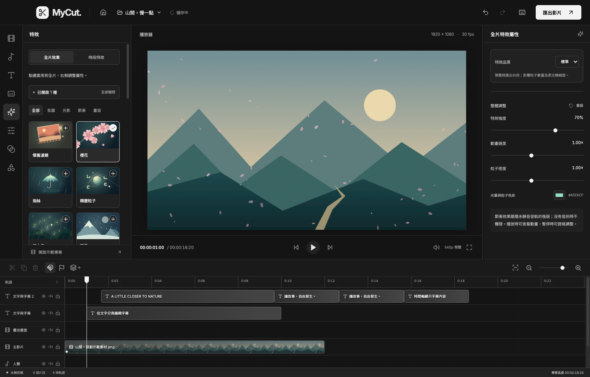
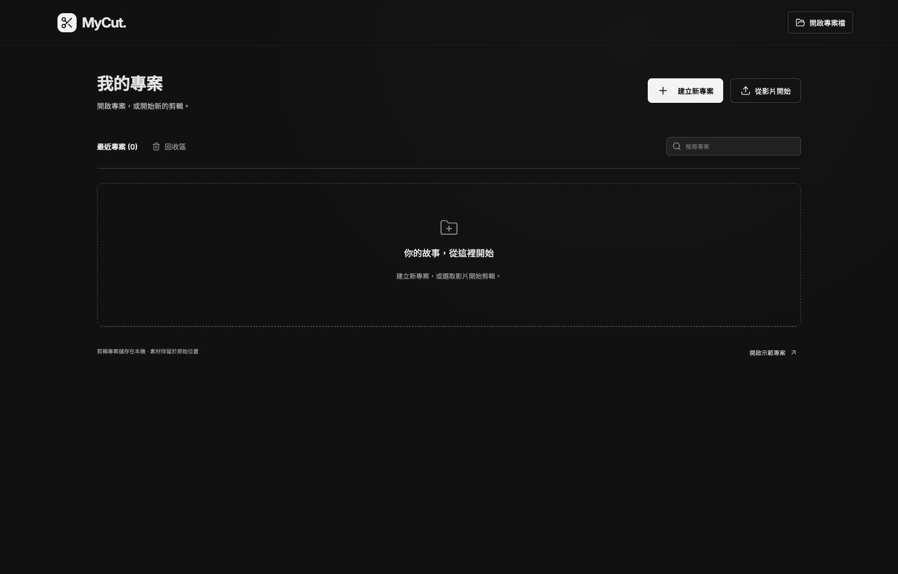

# MyCut

**Mac／Windows 本機多軌影片剪輯器**

MyCut 將影片剪輯、文字、字幕、歌詞與視覺特效整合在同一個時間軸，適合製作日常影片、教學內容和音樂影片。素材處理、語音辨識與影片匯出都在自己的電腦完成，不需帳號或 API 金鑰。

內建 **40 種特效、40 款可商用字型**，支援自動字幕、卡拉 OK 逐字高亮，以及最高 4K 的無浮水印 MP4 匯出。



[安裝與開啟](#安裝與開啟) · [快速開始](#快速開始) · [剪輯操作](#時間軸與剪輯) · [文字與字型](#文字與字型) · [字幕與歌詞](#字幕與歌詞) · [特效](#特效濾鏡與轉場) · [匯出](#匯出影片) · [常見問題](#常見問題)

## 可以做什麼

| 功能 | 用途 |
| --- | --- |
| 專案管理 | 建立、搜尋、重新命名、複製與還原專案，自動儲存剪輯進度 |
| 多軌剪輯 | 排列影片、圖片、音訊與文字，修剪、分割、變速，多選及群組操作 |
| 文字與字型 | 編輯多行文字、樣式和位置，搜尋字型並設定我的最愛 |
| 字幕與歌詞 | 離線自動辨識、SRT 匯入匯出、批次校對、逐字校時與高亮 |
| 特效與調色 | 氛圍粒子、光影、音樂連動、畫面特效、調色預設與色度去背 |
| 音訊處理 | 錄製旁白、分離音訊、調整音量、淡入淡出與穩態噪音抑制 |
| 動畫與轉場 | 位置、縮放及透明度關鍵影格，淡入淡出與交叉溶解 |
| 匯出與搬移 | MP4 匯出、工作佇列、暫停續跑，以及包含素材的完整專案包 |

## 安裝與開啟

### 選擇對應平台

| 電腦 | 系統需求 | 使用方式 |
| --- | --- | --- |
| Mac Apple Silicon（M 系列） | macOS 14 以上 | 選擇檔名含 `macOS-arm64` 的 ZIP，解壓縮後開啟 `MyCut.app` |
| Mac Intel | macOS 14 以上 | 選擇檔名含 `macOS-x64` 的 ZIP，解壓縮後開啟 `MyCut.app` |
| Windows Intel／AMD | Windows 11，x64 | 使用 Windows 安裝程式，或完整解壓縮 Windows ZIP 後開啟 `MyCut.exe` |

Mac 可將 `MyCut.app` 移到「應用程式」。Windows 免安裝版需保留同資料夾內的資源與 DLL；x64 語音引擎需要支援 AVX2 的處理器。

封裝版包含 FFmpeg、離線語音模型和字型，不需安裝 Node.js。若使用已完成封裝的專案資料夾，也可雙擊 `啟動 MyCut.command`（Mac）或 `啟動 MyCut.cmd`（Windows）。安裝包位於本機 `release/`，不隨 Git 原始碼提供；只有原始碼時，請依照[開發與建置](#開發與建置)啟動。

平台相容性、簽章與實機驗證範圍見[平台說明](docs/cross-platform.md)。

## 快速開始

1. **建立專案。**首頁點「建立新專案」，會直接進入名為「未命名專案」的編輯畫面，預設為 16:9、1920 × 1080、30 fps。也可點「從影片開始」，選取影片、圖片或音訊開始剪輯。
2. **加入素材。**在左側「素材」點「匯入素材」，或將檔案拖入素材區，再加入時間軸。
3. **完成剪輯。**拖曳片段排列順序、拉動邊緣修剪，並在右側調整位置、大小、速度或音量。
4. **加入文字與效果。**從左側選擇「文字」、「字幕」、「特效」、「濾鏡」或「轉場」，在右側調整所選內容的屬性。
5. **輸出成品。**點右上角「匯出影片」，設定解析度與畫質，按「開始匯出」；完成後按「儲存影片」取得 MP4。

## 認識編輯介面

| 區域 | 操作方式 |
| --- | --- |
| 左側功能區 | 匯入素材、新增文字、辨識字幕、錄音、選擇特效與批次操作 |
| 中央播放器 | 預覽合成畫面、播放暫停與定位影格 |
| 右側屬性區 | 修改目前選取內容的文字、字型、時間、位置、樣式及效果參數 |
| 下方時間軸 | 安排片段、修剪長度、管理軌道與控制播放頭位置 |

將滑鼠停在圖示上可查看功能名稱；鍵盤 Tab 聚焦也會顯示提示。拖曳播放器左右的分隔線，可自由調整功能區、播放器和屬性區的寬度，各區保留最小操作寬度；按兩下分隔線可重設該側寬度。

## 專案管理



首頁提供專案搜尋、重新命名、複製、回收區與還原。點選專案卡片可繼續編輯，也可用「開啟專案檔」匯入剪輯設定或完整專案包。

編輯時會自動儲存，亦可按 `⌘ S`／`Ctrl S`。點左上角房屋圖示，或關閉編輯視窗，會先儲存再回到專案首頁；錄音中需先停止錄音。若儲存失敗，編輯畫面會保留，方便重試。

專案支援橫式、直式、方形等常用比例。影格率可在空白專案設定，適合先決定影片用途再開始剪輯。

## 時間軸與剪輯

- **排列與修剪：**拖曳片段調整時間位置，拉動左右邊緣修剪長度；單一片段可移到其他相容軌道。
- **分割與複製：**將播放頭移到剪接位置，選取片段後分割；也可複製、刪除，或用同軌漣漪刪除讓後方片段接上。
- **多選與群組：**在時間軸空白處框選，或按住 `Shift`／`⌘`／`Ctrl` 點選多個片段，再一起移動、修剪、分割或建立群組。
- **軌道管理：**依需求鎖定、隱藏或靜音軌道；使用磁吸、標記、縮放及全片檢視輔助排列。
- **片段屬性：**選取片段後，在右側調整位置、縮放、旋轉、翻轉、裁切、透明度，或設定 0.25×–4× 等速變速。

同一軌道的片段不會重疊，新增片段以接續方式加入。文字、圖形與時段特效會以軌道末端和播放頭較後的位置為起點。不同軌道可以同時播放，用於疊圖、字幕和混音。

時間軸上的文字片段直接顯示內容，修改文字後會同步更新，方便辨認每一句字幕。

## 文字與字型

### 新增與編輯文字

1. 在左側「文字」按「新增文字」，或在「字幕」按「新增字幕」。
2. 選取時間軸上的文字片段，在右側「文字」修改內容。
3. 調整字型、字級、顏色、背景、位置及顯示時間。

右側的「字幕」分頁用來搜尋、瀏覽及選取專案中的文字、字幕與歌詞；點選一句會定位到該片段，切換「文字」分頁即可編輯。字幕清單支援分頁，長影片也可快速查找內容。

### 選擇字型與我的最愛

展開右側「文字」中的字型清單，每款字型會以自己的字體顯示名稱。可搜尋字型，點名稱套用到目前文字，或勾選星號加入「我的最愛」。

- **預設字型：**依完整列表順序，使用第一款已勾選的最愛。
- **首次使用或沒有最愛：**使用列表第一款「思源黑體 TC」。
- **套用範圍：**預設字型用於新增文字、手動字幕、SRT 匯入及自動辨識結果；已存在的片段保留原字型。
- **設定保存：**最愛會保存在本機，重新開啟程式後仍保留。

內建 10 款繁中字型與 30 款英文字型。繁中字型包含思源黑體 TC、思源宋體 TC、霞鶩文楷 TC、jf open 粉圓、芫荽、可可黑體、昭源黑體、昭源宋體、昭源環方及辰宇落雁體。英文字型缺少的中文字會由思源黑體 TC 補上。

字型均隨附 **SIL Open Font License（OFL）**，可用於商業影片。完整名稱與來源見[字型清單](public/fonts/manifest.json)，各字型目錄保留授權文件，也可由介面下載授權。

## 字幕與歌詞

### 自動字幕

1. 將含有人聲的影片或音訊加入時間軸。
2. 開啟左側「字幕」，選擇「自動字幕」。
3. 選擇整個時間軸或目前片段、指定語言，再按「開始辨識字幕」；中文可轉為繁體。
4. 完成後按「校對與加入」，修正文字與起訖時間，再加入時間軸。

辨識採用 **whisper.cpp 與多語言 Whisper Small Q5_1 模型**，在本機 CPU 執行。工作可暫停與續跑；若之後改動來源音訊的時間軸，需重新辨識以對齊內容。

### 自動歌詞與卡拉 OK

在左側「字幕」切換「自動歌詞」，完成辨識與校對後加入時間軸。選取歌詞片段，在右側「文字」中的「卡拉 OK 歌詞」調整高亮顏色，使用「逐字校時」播放打點或手動修正字詞時間。

歌詞支援逐字高亮；中文可按字重新分段。選取已有有效逐字時間的歌詞後，可從左側「字幕」按「匯出所選歌詞 LRC」。辨識結果仍需校對，尤其是重伴奏、合唱或特殊唱腔。

### 字幕檔案與批次整理

左側「字幕」可匯入與匯出 SRT；手動匯出的 SRT 包含專案中的所有文字片段，包含標題。辨識校對視窗也可匯出該批字幕或歌詞。

使用「字幕批次編輯」，可依範圍與文字篩選，執行搜尋取代、標點整理、每行字數調整與統一樣式。先確認預覽再套用，整批操作可一次復原。

## 特效、濾鏡與轉場

### 套用特效

在左側「特效」選擇模式，再點選效果卡片：

| 模式 | 使用方式 |
| --- | --- |
| 全片效果 | 套用到整個專案，可同時開啟多種效果；再點一次卡片可關閉，或用「全部關閉」清除 |
| 時段特效 | 加入獨立特效片段，在時間軸調整開始位置與長度；右側可設定淡入淡出及強度關鍵影格 |

全片與時段特效各自保存設定。品質、強度、動畫速度、密度及色彩由右側屬性區調整；兩種模式都作用於合成畫面，包含文字與字幕。

| 類別 | 效果 |
| --- | --- |
| 氛圍 | 懷舊濾鏡、櫻花、雨絲、精靈粒子、螢火蟲、飄雪、落葉、蒲公英、火星／餘燼、星空／流星、泡泡、漂浮愛心、蝴蝶、彩色紙花 |
| 光影 | 散景、暗角、漏光、霧氣、極光、環境光暈、柔光 Bloom、光線掃過、流動絲帶、晨光射線、十字星芒 |
| 節奏 | 節奏閃光、節奏色偏、節奏煙火、節奏震動、音樂頻譜、節奏波紋、節奏放射線 |
| 畫面 | VHS 錄影帶、萬花筒、鏡像、雨滴玻璃、底片顆粒、像素風、漫畫網點、電影黑邊 |

節奏效果跟隨未靜音音軌的聲音強弱；沒有音訊時不會觸發。音樂頻譜可切換直條、環形與波形。每種特效都有獨立示意圖，可先從[特效美術總覽](docs/artwork-effects.png)了解外觀。

### 調色、動畫與轉場

選取畫面片段後，可從左側「濾鏡」套用 8 組調色預設，並在右側「調色」調整亮度、對比、飽和度、模糊或色度去背。

在右側「動畫」加入關鍵影格，再到「基本／文字」調整目前影格的位置、縮放及透明度。左側「轉場」提供淡入、淡出、淡入淡出與交叉溶解；交叉溶解會以分軌淡化維持同軌不重疊。

## 音訊與旁白

將背景音樂或人聲加入音訊軌後，選取片段，在右側「音訊」調整音量、淡入淡出與穩態噪音抑制；噪音抑制在匯出時生效。

要從影片取出聲音，先選取含音訊的影片，再到左側「音訊」按「分離音訊」。分離後的聲音與影片會建立連動，方便一起編輯。

要錄製旁白，在左側「音訊」按「錄製旁白」，允許麥克風權限；完成後按「停止錄音並加入素材」，再將錄音加入時間軸。

## 匯出影片

1. 點右上角「匯出影片」。
2. 選擇 **720p、1080p 或 4K**，以及標準或高畫質。
3. 選擇編碼器。Mac 可依可用項目使用 Apple 硬體加速；Windows 使用軟體編碼。
4. 按「開始匯出」，在工作清單查看進度，需要時可暫停並按「繼續」。
5. 完成後按「儲存影片」，選擇 MP4 的儲存位置。

成品使用 H.264 視訊與 AAC 音訊，沒有浮水印。預覽使用較低解析度及代理素材協助編輯，匯出則使用原始素材。

### 長影片與續跑

匯出採分段處理與逐格串流，避免一次載入整部影片。已完成的區段會保留，支援工作暫停與程式重啟後續跑；開始匯出時會保存專案快照，後續編輯不會改變已建立的工作。

製作一小時影片時，請保留來源素材及足夠的磁碟空間，包含分段暫存需要的容量。高解析度、疊加層數和特效數量都會影響匯出時間。完整一小時的 1080p／4K 壓力測試尚未完成，詳細處理方式與測試範圍見[長片指南](docs/editor-guide.md)。

## 專案備份與跨電腦搬移

| 格式 | 保存內容 | 適合用途 |
| --- | --- | --- |
| `.mycut.json`／`.mycut` | 剪輯設定與素材參照 | 保留剪輯設定，在原本媒體庫使用 |
| `.mycutpack` | 剪輯設定與用到的原始素材 | 在另一台 Mac／Windows 還原完整專案 |

搬移專案時，在桌面版開啟「專案管理 → 打包完整專案」，儲存 `.mycutpack`；到目的電腦用「開啟專案檔」還原。還原會建立新的專案與素材，不會覆蓋既有內容。字型最愛屬於個人設定，不隨專案包搬移。

原始素材以本機檔案參照讀取。若移動或刪除來源檔案，請在素材卡片使用「重新連結」。要備份完整工作環境，退出程式後，同時備份資料目錄與原始素材。

| 執行方式 | 預設資料位置 |
| --- | --- |
| Mac 桌面版 | `~/Library/Application Support/MyCut/workspace/` |
| Windows 桌面版 | `%APPDATA%\MyCut\workspace\` |
| 原始碼開發版 | 專案目錄下的 `.mycut/` |

## 常用快捷鍵

以下適用於編輯畫面；輸入文字或開啟對話框時，不會攔截一般編輯快捷鍵。

| 動作 | Mac | Windows |
| --- | --- | --- |
| 播放／暫停 | `Space` | `Space` |
| 全選片段 | `⌘ A` | `Ctrl A` |
| 群組／解除群組 | `⌘ G`／`⌘ Shift G` | `Ctrl G`／`Ctrl Shift G` |
| 分割片段 | `⌘ B` | `Ctrl B` |
| 複製片段 | `⌘ D` | `Ctrl D` |
| 儲存專案 | `⌘ S` | `Ctrl S` |
| 匯出影片 | `⌘ E` | `Ctrl E` |
| 復原 | `⌘ Z` | `Ctrl Z` |
| 重做 | `⌘ Shift Z` | `Ctrl Shift Z` 或 `Ctrl Y` |
| 刪除片段 | `Delete`／`Backspace` | `Delete`／`Backspace` |
| 同軌漣漪刪除 | `Shift Delete`／`Shift Backspace` | `Shift Delete`／`Shift Backspace` |
| 前後一影格／一秒 | `←`、`→`／加 `Shift` | `←`、`→`／加 `Shift` |
| 加入標記／快捷鍵說明 | `M`／`?` | `M`／`?` |

## 常見問題

| 問題 | 處理方式 |
| --- | --- |
| 找不到圖示代表的功能 | 將滑鼠停在圖示上，或用 Tab 聚焦，查看功能名稱 |
| 新增文字出現在後面 | 同軌片段不重疊，新片段會接到軌道末端或更後方的播放頭位置 |
| 改了預設字型，舊字幕沒有變 | 最愛預設只影響新增內容；既有字幕需選取後換字型，或使用字幕批次編輯 |
| 節奏特效沒有反應 | 確認時間軸內有音訊、音軌未靜音且音量不為零，並等待首次音訊分析完成 |
| 辨識進度暫時不動 | 辨識以區段完成後更新進度；可查看工作狀態或暫停後續跑 |
| 專案開啟後素材離線 | 保留原始素材位置，或在素材卡片按「重新連結」；跨電腦搬移請使用完整專案包 |
| 匯出空間不足 | 清出專案資料所在磁碟的空間，將分段暫存容量一併計入 |
| Windows ZIP 無法開啟 | 完整解壓縮後執行 `MyCut.exe`，保留所有資源與 DLL，並確認使用 x64 電腦 |
| 原始碼版缺少字型或模型 | 分別執行 `npm run fonts:install` 與 `npm run speech:install` |

## 開發與建置

主要使用 **TypeScript、React、Electron 與 Node.js**，影音由 FFmpeg 處理，離線語音辨識使用 whisper.cpp。

從原始碼啟動需要 Node.js 22 以上。Mac 編譯語音引擎另需 Xcode Command Line Tools 與 CMake；首次安裝相依套件、字型及語音資源需要網路。

```sh
npm ci
npm run fonts:install
npm run speech:install
npm run desktop
```

字型檔、語音模型、平台執行檔、下載快取與封裝產物不納入 Git；資源清單、授權和安裝腳本保留在專案內。`npm run desktop` 會先建置再開啟應用程式。

| 指令 | 用途 |
| --- | --- |
| `npm run dev` | 啟動開發介面與本機服務 |
| `npm run build` | 型別檢查與正式建置 |
| `npm test` | 執行核心測試 |
| `npm run test:ui` | 驗證瀏覽器操作流程 |
| `npm run test:effects` | 驗證特效實際匯出與分段處理 |
| `npm run package:mac` | 封裝目前 Mac 架構的應用程式 |
| `npm run package:mac:x64` | 封裝 Intel Mac 應用程式 |
| `npm run package:mac:arm64` | 封裝 Apple Silicon Mac 應用程式 |
| `npm run package:win` | 製作 Windows 安裝程式與免安裝 ZIP |

開發介面位於 `http://127.0.0.1:5173`；原生選檔、素材重新連結與完整專案包請在桌面版操作。瀏覽器測試需要 Chrome 或 Playwright Chromium。Mac 封裝需在 macOS 執行；Windows 封裝可在 Windows 或 Mac 執行。

## 延伸閱讀與授權

- [編輯、字幕與長片指南](docs/editor-guide.md)
- [群組、時段特效與專案包操作](docs/workflow-guide.md)
- [平台與封裝說明](docs/cross-platform.md)
- [第三方元件與授權聲明](THIRD_PARTY_NOTICES.md)
