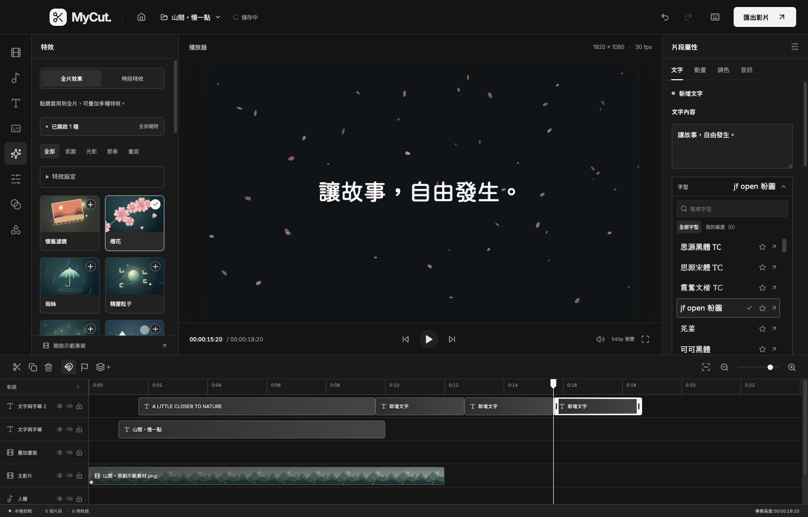
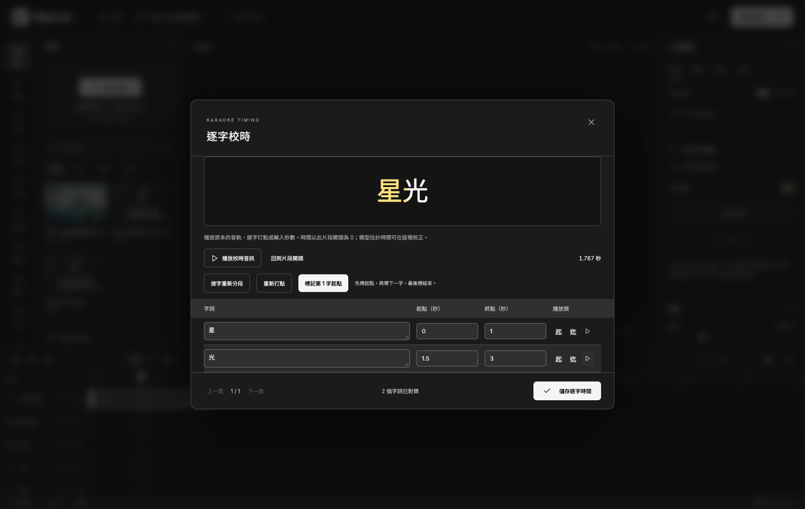
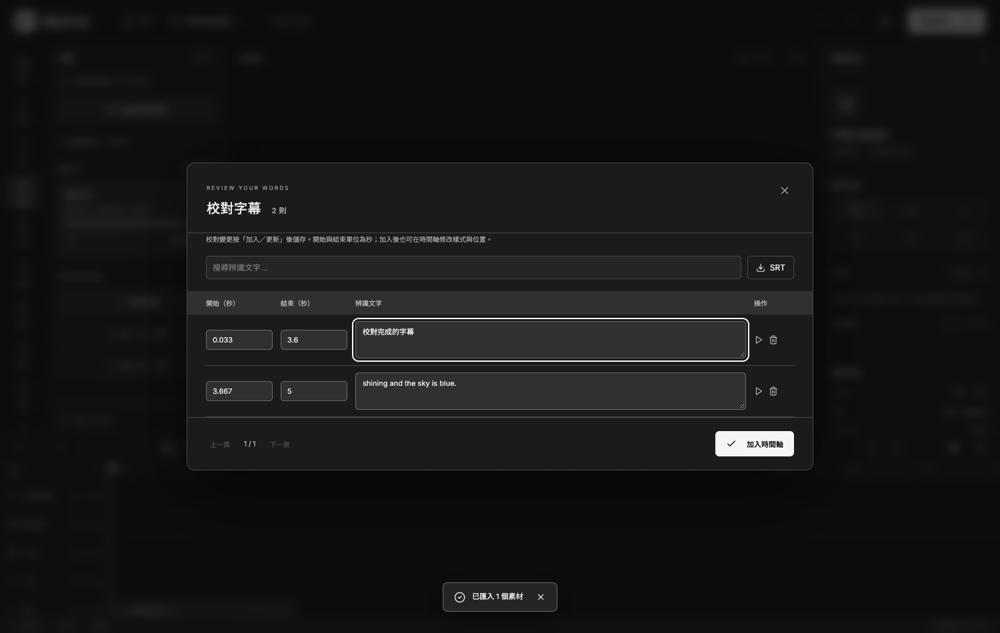

# MyCut 編輯與長片處理指南

[返回 README](../README.md) · [跨平台版本說明](cross-platform.md) · [驗證紀錄](validation.md)

本文件說明特效、自動字幕、卡拉 OK 歌詞及長片處理方式。安裝、首次操作、快捷鍵與建置指令請見 README。

## 左右分工

左側功能區用來新增、匯入、辨識、批次處理與選擇效果；右側屬性區用來修改選取內容的文字、樣式、時間與參數。時間軸工具列保留分割、刪除、複製與群組等剪輯操作，頂部保留專案管理、復原與影片匯出。

| 左側功能 | 右側屬性 |
| --- | --- |
| 文字：新增文字、宋體／英文標題樣式 | 文字內容、字型、顏色、大小及歌詞逐字校時 |
| 字幕：新增、辨識、批次、SRT 與所選歌詞 LRC 匯出 | 字幕清單選取，再到文字分頁編輯 |
| 特效：選擇全片或時段效果 | 全片特效或所選特效片段的品質、強度、密度與色彩 |
| 濾鏡／轉場：選擇預設效果 | 調色數值、淡入淡出長度 |
| 音訊：匯入、錄製旁白、分離音訊 | 音量、音訊淡入淡出、降噪；基本分頁調整時間及速度 |

全片特效和時段特效各自保存參數。點左側「全片效果」會顯示右側全片屬性；選時間軸片段則回到該片段屬性。縮放、位置與不透明度只在「基本／文字」分頁調整；在「動畫」加入關鍵影格後，回到同一組變形欄位編輯目前播放頭的數值。沒有聲音的片段不顯示音訊分頁。

## 特效

進入編輯器後，點左側 **「特效」**。「全片效果」模式下點卡片開啟，再點一次關閉，可同時疊加多種效果；原本「濾鏡」仍調整選取的畫面片段。

- 氛圍：懷舊濾鏡、櫻花、雨絲、精靈粒子、螢火蟲、飄雪、落葉、蒲公英、火星／餘燼、星空／流星、泡泡、漂浮愛心、蝴蝶、彩色紙花。
- 光影：散景、暗角、漏光、霧氣、極光、環境光暈、柔光 Bloom、光線掃過、流動絲帶、晨光射線、十字星芒。
- 節奏：節奏閃光、節奏色偏、節奏煙火、節奏震動、音樂頻譜、節奏波紋、節奏放射線。
- 畫面：VHS 錄影帶、萬花筒、鏡像、雨滴玻璃、底片顆粒、像素風、漫畫網點、電影黑邊。

像素風的「粒子密度」越高，色塊越大；漫畫網點依畫面明暗產生印刷點陣。電影黑邊遮住畫面上下各 12%，不改變輸出尺寸；強度控制遮幅透明度。底片顆粒為固定種子的黑白雜點。

品質可選輕量、標準或精細，影響新增粒子的數量及柔光細節；預覽與輸出採相同設定。鏡像可選左右、上下或四向，萬花筒可選 4／6／8／12 瓣。

左側選擇特效，右側調整整體強度、動畫速度、粒子密度與光暈色彩；左側「全部關閉」可停用全片效果。全片效果套用整個專案；「時段特效」模式會在播放頭或該軌末端（取較後者）加入 3 秒的獨立片段，可在特效軌裁切、移動、分割，在右側設定淡入淡出與強度關鍵影格。兩種模式均處理合成畫面，包含文字與字幕；全片效果先繪製，時段效果再依特效軌由下往上疊加。支援復原、重做、專案自動儲存及匯出。舊專案預設關閉所有特效。

外觀依本機 `lyric_flow` 的氛圍特效移植，粒子運動改為固定種子與絕對時間計算，便於任意倒帶與分段續跑。精靈粒子使用已收錄、可商用的思源黑體 TC 注音符號，不依賴外部字型。沒有搬入音樂視覺化工具的歌曲工作流程、場景生成或其他編輯介面。

節奏效果採本機 50 Hz 音量包絡與突增偵測，依時間軸裁切、變速、音量、淡入淡出、隱藏及靜音取樣。首次開啟相關效果會分析素材並快取；沒有音訊就不觸發節奏閃光／色偏／煙火／震動／波紋／放射線。這是音量突增連動，不是歌曲拍號或 BPM 精準追蹤。環境光暈也有緩慢的呼吸動畫。

音樂頻譜可選直條、環形或波形，調整位置、大小及色彩。使用實際音訊的 512 點 Hann FFT，8 kHz 單聲道、32 個對數頻帶（40–4000 Hz）；每秒計算 25 次 FFT，存入 50 Hz 特徵快取。波形取自實際 PCM。遵循來源時間、音量、淡化及靜音，不產生假頻譜。變速時依來源位置取樣，沒有重新分析保留音高處理後的聲音；它是音樂視覺效果，不是量測級頻譜儀。一小時來源約 11.7 MB 二進位特徵（JSON Base64 約 15.6 MB），不保留整小時 PCM。

預覽與輸出共用 Canvas 繪製程式。原生 FFmpeg 合成後逐格串流到 Skia 繪製，再送回 FFmpeg 編碼，採背壓控制，不儲存整部影片的像素或逐格 PNG；單段 PCM 與視訊在完成或取消後清理。影片只做一次有損編碼。高解析度或同時開啟多種特效會增加匯出時間；瀏覽器和 Skia 的抗鋸齒可能有微小差異。

特效、轉場和濾鏡卡片已換成 53 張原創向量插畫：每種特效有獨立主題，轉場呈現淡化方向與交疊關係，濾鏡以同一構圖比較色調。素材都在本機，縮圖不需執行即時特效繪製，也不會加進匯出影片。可編輯來源為 [scripts/generate-library-art.ts](../scripts/generate-library-art.ts)，使用 `npm run art:build` 重新產生。

[新增 12 種特效美術](artwork-effects-new.png) · [特效美術總覽](artwork-effects.png) · [轉場美術總覽](artwork-transitions.png) · [濾鏡美術總覽](artwork-filters.png)

更多多選、群組與字幕批次操作見 [工作流程指南](workflow-guide.md)。

## 面板配置與字幕清單

播放器左右的細分隔線可拖曳。功能區至少 220 px、播放器至少 400 px、屬性區至少 240 px；拉寬其中一側時，播放器會相應縮小，抵達最小值即停止。視窗縮小時會自動收窄兩側，放大後恢復原先要求的寬度。按兩下分隔線恢復該側預設；鍵盤 Tab 聚焦後，左右鍵調整 10 px、Shift 加方向鍵調整 30 px，Home／End 調至最小／最大。拖曳中按 Esc 可取消這次調整。同次 App 執行期間跨專案保留寬度。

選取任何文字片段，右側分頁依序為「字幕」、「文字」。字幕分頁只保留搜尋與清單，按起點時間條列全部文字、字幕及歌詞；每頁最多 50 則。點選一列會選取片段並定位播放頭，再切換「文字」編輯內容、字型、樣式、時間及卡拉 OK 歌詞。返回「字幕」會保留搜尋條件與頁次；按搜尋框的清除按鈕回到全部字幕及所選字幕所在頁。從時間軸選到搜尋範圍外的字幕時，會自動回到全部清單。鎖定軌道的字幕會列出但不能從清單選取。新增文字、自動字幕／歌詞、批次編輯及 SRT 匯入／匯出由左側「文字」或「字幕」功能區操作。

時間軸上的文字區塊使用實際內容作為標籤，多行合併顯示、太長省略，空白內容顯示「空白文字」。修改、復原、重新開啟後都會跟隨內容；片段內部名稱仍可自行保留。

## 自動字幕與自動歌詞

素材加入時間軸後，點左側「字幕」，選「自動字幕」或「自動歌詞」。選整個時間軸或目前片段，設定音訊語言，按「開始辨識」。完成後按「校對與加入」，修改文字及起訖秒數，再加入時間軸。字幕放在獨立文字軌，可改樣式、位置及時間，也可復原。再次校對已加入的工作會讀取時間軸目前文字，更新僅替換同一批字幕。

封裝版內建 whisper.cpp 1.8.6 與多語言 Whisper Small Q5_1 模型（190 MB），使用本機 CPU，不需帳號、API 金鑰或網路，首次辨識不另下載模型。原始碼版需先依 README 執行 `npm run speech:install`。中文可轉為繁體。歌詞模式縮短斷句，提供可關閉的 100–6500 Hz 濾波及 LRC 匯出。沒有專業人聲分離；重伴奏、合唱和特殊唱腔需人工校對。

自動歌詞預設勾選「逐字時間與卡拉 OK 高亮」，自動字幕也可開啟。使用 Whisper Small 的 DTW 聲學對齊估計字詞時間，保留英文子詞合併與繁體轉換，不把整句等分成假時間。部分中文模型單位會包含數個字；未取得有效時間的句子保持一般字幕，需手動校時。

選取文字片段，在右側「文字」分頁的「卡拉 OK 歌詞」設定高亮顏色、開關及「逐字校時」。可播放音軌打點、輸入每個字詞的起訖秒數，或「按字重新分段」後重新打點。更改字幕文字會停用不再匹配的高亮。分割與左側修剪保留時間偏移；移動片段則讓歌詞時間一起移動。選取已完成校時的文字片段，可在左側「字幕」按「匯出所選歌詞 LRC」；辨識結果校對視窗仍可匯出整批逐字 LRC。

歌詞預覽與匯出共用字型排版與填色。匯出時只為當段製作透明、無損 QTRLE 歌詞層，再交給既有圖層合成，因此位置、縮放、淡化與上層遮蔽仍生效。每段結束或取消後清理暫存，無須在記憶體保存整小時影格。

辨識使用 30 秒主區段，兩側最多各 1 秒上下文，逐段擷取 16 kHz 單聲道音訊，不將整小時 PCM 載入記憶體。時間依剪輯後的裁切、變速、音量、靜音及位置計算。一次執行一個工作，可暫停、重啟後續跑。進度依完成段數更新，當段辨識時百分比可能暫停。修改音訊時間軸後，舊結果會阻擋套用。

## 長片處理

時間軸以整數影格儲存，匯出不用瀏覽器 WASM 或完整影片 Blob。原生 FFmpeg 將時間軸按 **最多 10 秒及片段邊界** 分段，一次只處理一段；完成分段後才原子改名與更新工作紀錄。中斷時保留已完成分段，下次繼續。

中間格式是 H.264 + PCM 的 MOV，最後複製視訊並只做一次 AAC 編碼，以避免反覆 AAC priming 造成接縫或時長誤差。混音以 48,000 Hz 樣本對齊；各支援影格率都可整除音訊樣本率。影片完成後會檢查時長，成功才移除中間檔。

匯出前預估磁碟空間；原始素材在排隊、續跑與最後合併前以大小和修改時間核對。工作使用獨立專案快照，剪輯中的變更不會改到正在匯出的版本。

預覽按比例縮至最多 960×540，直式 1080×1920 的預覽為 304×540，實際匯出解析度由專案與匯出設定決定。文字使用最多 8 張快取畫布及 1 張可重用畫布；同時超過 8 層仍會繪製全部文字。過期字幕畫布清空像素後移出快取，避免長片累積。這些文字畫布的像素上限約 18 MiB，不包含主畫布、GPU 副本、影片解碼器或特效資源。文字、樣式、字型、解析度變更會刷新；有效的逐字歌詞則依影格更新。

字型依目前可見文字載入並共用請求；音訊節奏需求及專案總長度避免逐格重算。切走片段或關閉編輯器時會停用媒體回呼、卸載來源並斷開音訊節點。

時間軸只繪製可視範圍的片段和刻度；預覽只建立當下使用的媒體元素，波形串流縮減到 600 個取樣值。記憶體仍會隨解析度、同時疊加層數、素材解碼器與特效增加，不能用短片結果推論複雜 4K 長片的性能。

## 驗證範圍

已有 Mac 的一小時低解析度匯出驗證，涵蓋分段、續跑與影音長度。**尚未完成一小時 1080p／4K、連續歌詞或 Windows 一小時匯出的壓力測試**；記憶體紀錄僅涵蓋 Node／Skia，不包含 FFmpeg、Electron 與 GPU。各項結果與測試條件見 [驗證紀錄](validation.md) 和 [跨平台版本說明](cross-platform.md)。
