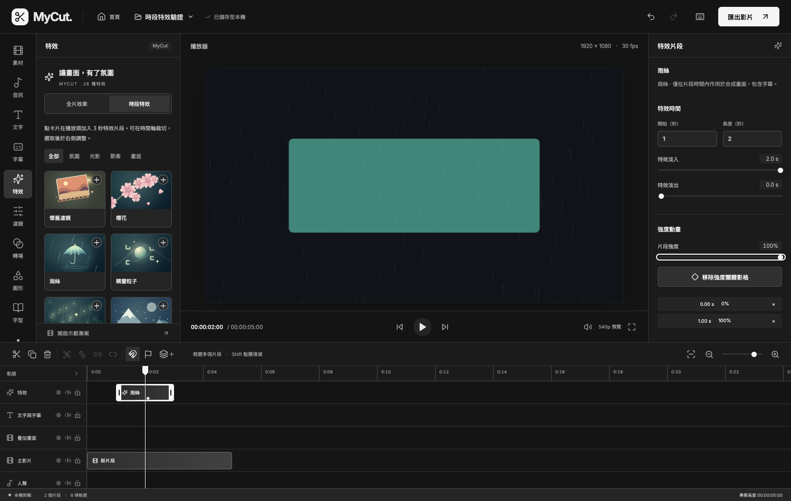
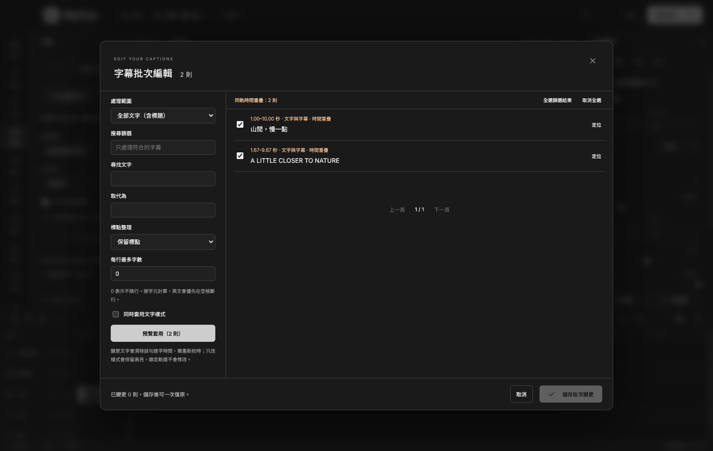

# MyCut 0.6.0 工作流程

[返回 README](../README.md) · [特效與辨識細節](editor-guide.md) · [跨平台說明](cross-platform.md)

## 完整專案包

1. 在桌面版開啟專案，按上方專案名稱，選「打包完整專案」。
2. 選擇 `.mycutpack` 的儲存位置，等待完成。進度框可取消，完成後會在系統檔案管理器顯示成品。
3. 將檔案移到另一台電腦，在 MyCut 首頁按「開啟專案檔」，選擇專案包。
4. MyCut 校驗內容、將原始素材還原到自己的資料目錄，並建立新的專案與素材 ID。

同一素材使用多次只打包一次；即使原始檔案已移走，還原的專案仍可播放與匯出。包含全部被專案參照的原始素材，包括隱藏軌道上的素材，且保留字幕、逐字時間、群組、音畫連動、特效與關鍵影格。原始素材完整保存，不會只截取時間軸上的片段。

專案包不包含代理檔、波形快取、辨識工作的排隊／續跑紀錄、匯出佇列或既有 MP4 成品；代理檔可在還原後重新建立。字型使用應用程式隨附的 40 款字型。

`.mycutpack` 是 MyCut 的串流容器，不是 ZIP。資料依序寫入，不將整包讀成瀏覽器 Blob；專案設定與每個素材均有 SHA-256 校驗，讀取時使用固定大小區塊，支援超過 4 GB 的檔案位移。打包前檢查空間，並在來源變更、校驗失敗或取消時清理未完成的檔案。新專案完成還原後才加入首頁，不覆蓋既有專案。

打包大小接近使用到的原始素材總和，需預留對應磁碟空間。取消後需重新開始打包，目前不支援專案包續傳。瀏覽器開發模式仍只支援 JSON 設定匯入；完整包需使用桌面版。0.5.0 無法讀取新的完整專案包或時段特效片段，請使用 0.6.0 以上版本。

## 多選、群組與音畫連動

- 從時間軸的空白位置拖曳框選；按住 Shift、Command（Mac）或 Ctrl（Windows）點選，可增減選取。
- Command／Ctrl A 全選。多選後可整批水平移動、邊緣修剪、分割、複製及刪除，維持相對位置；多選時不跨軌換位，單一片段可換軌。
- 按工具列「建立群組」或 Command／Ctrl G，之後點選其中一個片段會選取整組。解除群組使用工具列或 Command／Ctrl Shift G。
- 選取影片與音訊，按工具列「音畫連動」；左側「音訊 → 分離音訊」也會自動建立連動。移動、裁切、分割和右側的開始時間、長度、速度會同步處理；音量、畫面和文字樣式仍各自調整。
- 按「解除音畫連動」後可獨立處理。群組與音畫連動各自保留，解除一種關係不會自動移除另一種。

群組或連動內有鎖定軌道時，整組修改會被阻擋，避免只改到其中一部分。複製會建立新的群組／連動關係，不與原片段互相影響；分割後的左右兩組也各自獨立。漣漪刪除若會使下游群組或音畫錯位，會提示改用一般刪除。群組是平面的，目前沒有巢狀群組。

## 時段特效

1. 左側「特效」切換到「時段特效」。
2. 移動播放頭，點一張特效卡片，即可在播放頭或該軌末端（取較後者）加入 3 秒的特效片段；需要時會自動建立特效軌。
3. 在時間軸拖動或修剪片段；選取後從右側設定開始時間、長度、淡入、淡出及特效參數。
4. 在「強度動畫」加入關鍵影格，移動播放頭後再調整片段強度，建立線性變化。

實際強度為「特效強度 × 片段強度／關鍵影格 × 淡入淡出」。全片效果先處理；時段特效再依軌道由下往上、同軌依片段順序疊加。效果作用於已合成的全部畫面，包括文字與字幕。隱藏特效軌會停用該軌效果，鎖定則只防止編輯。

時段特效沿用絕對專案時間計算動畫，倒帶與分段續跑不會重新亂數生成。片段以整數影格計時，開始影格包含在效果內，結束影格不包含。特效若延伸到最後一段素材之外，也會延長專案，尾段使用專案背景。

## 字幕批次編輯

1. 左側「字幕」按「字幕批次編輯」，或選取文字後從右側「字幕 → 字幕功能」開啟。
2. 選擇字幕與歌詞、目前選取文字、目前軌道，或全部文字（含標題）。
3. 用搜尋篩選縮小範圍，並可取消勾選不需修改的句子。
4. 設定尋找／取代、標點、每行最多字數及樣式，按「預覽套用」。
5. 檢查右側結果，再按「儲存批次變更」；取消不會修改專案，儲存後可一次復原。

尋找／取代採區分大小寫的完整字串比對，不使用正規表示式。「每行最多字數」為 0 時保留原換行，其他數字按字元換行並保留 emoji 等組合字元，英文優先於空格換行；不會自動改變字幕的時間或切成多個片段。

「轉為全形中文標點」處理逗號、句點、問號、驚嘆號、冒號、分號與括號，會同時影響數字小數點，請先預覽。修改文字會清除該句逐字時間，需再手動校時；只更改字型、大小、顏色或背景不影響高亮。

鎖定軌道會略過。重疊提醒只檢查同一軌道，不會把分軌的雙語字幕判定成衝突；提醒不會自動更動時間。舊專案中的手動字幕可能沒有字幕類別，可選「全部文字」或指定軌道處理。

## 驗證

- `npm test`：群組／連動、剪裁時間、複製／分割、新舊資料結構、特效邊界、字幕處理、完整包還原與取消清理。
- `npm run test:ui`：框選、多選、群組、復原、特效片段設定及字幕批次操作。
- `npm run test:workflow`：720p 實際匯出、特效進出場邊界、分段畫面一致性、暫停續跑、移走來源後還原並匯出。
- `npm run test:portable:desktop`：封裝版原生匯入／打包，在全新資料庫還原並輸出，驗證原生選檔與 Electron 整合。

目前原生執行證據來自 Intel Mac。Windows／Apple Silicon 已有對應測試指令，實機結果仍待各自環境確認；本次不代表一小時 1080p／4K 壓力測試。

## 字型最愛與預設

選取文字片段，在右側「文字內容 → 字型」展開清單，可搜尋名稱或風格，勾選星號加入「我的最愛」，或切換到只看最愛。每行直接用該字體顯示字型名稱；點選名稱只修改目前片段。清單下方顯示預設字型，採列表中第一個最愛；初次或全部取消時，預設是第一款思源黑體 TC。最愛存於本機 `preferences.json`，重啟與不同專案共用，不隨專案包移轉。

新增一般文字、手動字幕、SRT 匯入、自動字幕與歌詞會使用預設字型；原有片段保留自己的字型；宋體／英文標題樣式採用樣式指定的字型。

## 同軌接續與碰撞

新增片段接到該軌末端，若播放頭更後方則使用播放頭位置。連續點選文字樣式會依序排列，每次選取新片段並定位到它的起點。複製群組會整組移到相關軌道的末端之後，保留群組內的時間差。

同軌拖曳、左右修剪與屬性中的時間調整會避開其他片段；變慢會延長片段，若因此碰到後方內容，會提示先移開片段或換軌。不同軌道可疊加畫面、字幕與音訊。

SRT、自動字幕／歌詞及分離音訊保留原時間碼，遇到同軌占用時建立另一軌；交叉溶解使用兩軌交疊淡化。最多 32 軌，超過時會提示整理軌道。舊專案已存在的重疊片段保留原時間，可拖到空白處或另一軌整理。
